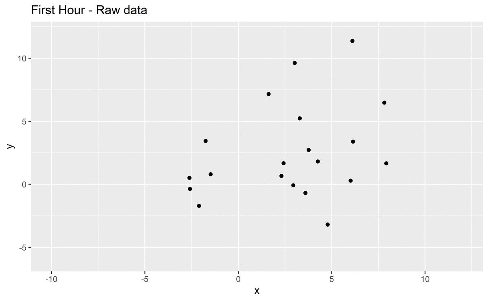

```{r setup, include=FALSE}
knitr::opts_chunk$set(echo = FALSE)
library(tidyverse)
```

```{r titleslide, child="components/titleslide.Rmd"}
```

---
# Introduction


---
# Research aims and	questions

__The overall research aim is to provide probabilistic estimates of the cause of fire ignition for the 2019-2020 bushfires.__ 
--

1. Using satellite hotspots data can we detect ignition time and location? 
--

2. Can data from other sources including vegetation, weather, proximity to road and recreation site help to inform ignition type?
--

3. How do the characteristics of 2019-2020 bushfires compare to historical bushfires?
--

4. Can we make a useful model for the fire risk across Australia? What predictors including fire indexes, proximity to road and recreation site, weather and vegetation are useful for modelling fire risk? 


---
# Review of literature

- **Generalised additive model**(GAM) is the common model for fire ignition prediction.

    eg. $$E(Y_t) = \beta_0 + f_1(x_{1,t}) + f_2(x_{2,t}) + ... + f_m(x_{m,t})\\Y_t:\text{ Number of ignitions in an area at time t}$$
    
    or $$g(E(Y_t)) = \beta_0 + f_1(x_{1,t}) + f_2(x_{2,t}) + ... + f_m(x_{m,t})\\Y_t:\text{ Ignition probability of bushfire in an area at time t}$$

---
# Review of literature

1. There are also other models forms: simulation modelling, GAM with mixed-effect, negative binomial regression, etc.
--

1. Common covariates for ignition analysis are

    a. weather conditions, 
--

    b. vegetation types, 
--

    c. topographic information and
--

    d. anthropogenic variables
--

2. Alouthgh semi-parametric and parametric methods are well studied in this field, little use of machine learning models has been made.
--

3. 2019-2020 bushfires are recent hazard events, little existing work has discussed their causes.


---
# Project design
<div class="grid" style="margin-top:10px;">
  <div class="gird-col">
    <h2>Data collection</h2>
    <ul>
      <li>Hotspots - Himawari-8 satellite</li>
      <li>Weather - Bureau of Meteorology</li>
      <li>Fuel layer - Forest of Australia</li>
      <li>Fire origins - DELWP</li>
      <li>Roads - OpenStreetMap</li>
      <li>Recreation sites - DELWP</li>
    </ul>
    <h2>Data Pre-processing</h2>
    <ul>
      <li>Spatiotemporal clustering</li>
    </ul>
    
  </div>
  <div class="gird-col">
    
    
    
    <figure style="width:30%;margin-bottom:2px;margin-top:2px;display:inline-block;padding:0px;text-align: center;">
      
      
      
      <figcaption style="font-size:15px">OpenStreetMap</figcaption>
    </figure> 
    <figure style="width:30%;margin:0px;margin-bottom:2px;display:inline-block;padding:0px;">
      
      <figcaption style="font-size:15px">Liftoff of the H-IIA rocket carrying Himawari 8 on October 7, 2014</figcaption>
    </figure>
     
  </div>
</div>


---
# Project design
## Spatiotemporal clustering

.grid[

1. Connect adjacent points (3km)
2. For each point, if there is a <u>connected</u> <u>nearest</u> <u>known</u> centroid, join its group
3. Otherwise, create a new group
4. Compute centroid for each group
5. Keep the group alive until no activities for 24 hours
6. Repeat this process
  

]
---

#Project design
## Clustering result


.without-left-right-margin[
  
]

---
#Project	design
## Plan for modelling

1. **Ignition method prediction model**

  *Training data*: Historical causes of bushfires
  
  *Response variable*: Ignition types (Multi-class) 
  
  *Independent variables*: vegetation, topographic and climate information
  
  *Model forms:* statistical models and computational models
--

2. **Fire risk model**

  *Training data*: Hotpots data
  
  *Response variable*: Ignition probability
  
  *spatial resolution:* 50km 
  
  *Model forms and independent variables*: similar as above

---
# Timeline


## Completed work


```{r timeline, results='asis'}
timeline = data.frame(Timeline = c("Week 2","Week 3", "Week 4", "Week 5", "Week 6", "Week 7","Week 8", "week 9"),
                      Tasks = c("Geographic data background reading",
                                "Collect Remote sensing data (JAXA himawari-8 satellite) and explore BOM weather data APIs (Bomrang)",
                                "Collect Road Map (OpenStreetMap) and read articles in SpatioTemporal data visualization and modelling",
                                "Develop clustering algorithm for remote sensing data",
                                "Test diferent hyperparameters for clusetring",
                                "Exploratory data analysis on fire clusters and data integration",
                                "Feature planning for the shiny app",
                                "Write research proposal and prepare the first presentation"))


knitr::kable(timeline,'html') %>%
  kableExtra::kable_styling(font_size = 18, position = "left")
  
```


## Research plan 


```{r}
timeline = data.frame(Timeline = c("June - July", "August", "September", "October"),
                      Tasks = c("Modelling fire ignition and fire risk", "Consolidate findings and create mockups of the shiny app", "Develop the shiny app and perform different levels of testing", "Write thesis and prepare the second presentation")) 

knitr::kable(timeline,'html') %>%
  kableExtra::kable_styling(font_size = 18, position = "left")
```


---
# Expected outcomes
## Ignition cause
It is expected that we will have probabilistic predictions for ignition cause for each of the fires
identified from the hotspot data during 2019-2020 Australian bushfire season. 
## Fire risk
A usable model of fire risk will be produced and made accessible in an interactive web application


---
##Figure Source 
.font_small[
Bushfire - https://upload.wikimedia.org/wikipedia/commons/9/9a/Werombi_Bushfire.jpg

Himawari-8 - https://upload.wikimedia.org/wikipedia/commons/e/e0/H-IIA_F25_launching_Himawari-8.jpg

Bomrang - https://github.com/ropensci/bomrang/blob/master/man/figures/logo.png

DELWP - https://www2.delwp.vic.gov.au/__data/assets/git_bridge/0015/177/deploy/mysource_files/logo-copy.png

OSM - https://wiki.openstreetmap.org/wiki/File:Public-images-osm_logo.png

SF - https://user-images.githubusercontent.com/520851/34887433-ce1d130e-f7c6-11e7-83fc-d60ad4fae6bd.gif

Tidyverse - https://raw.githubusercontent.com/tidyverse/tidyverse/master/man/figures/logo.png

Deparment of Agriculture - https://www.agriculture.gov.au/themes/custom/agriculture_base/images/abares-logo.svg
]

---
```{r endslide, child="components/endslide.Rmd"}
```


