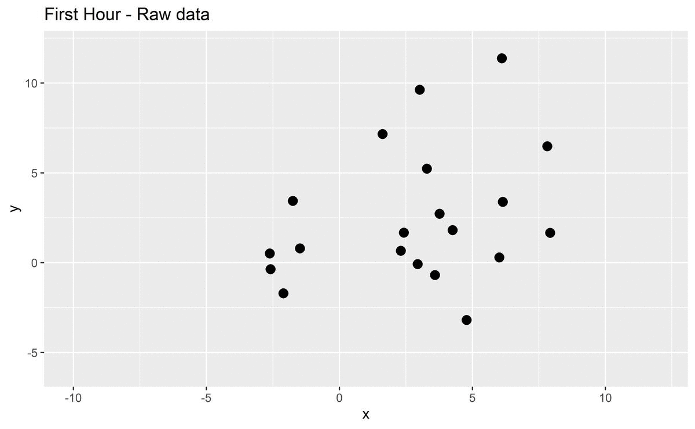

```{r setup, include=FALSE}
knitr::opts_chunk$set(echo = FALSE)
library(tidyverse)
```

```{r titleslide, child="components/titleslide.Rmd"}
```

---
# Introduction

.grid[

<div style="font-size:18pt">
<h2>2019-2020 bushfire season</h2>
<p>
<b style="font-size:24pt">Impact</b><br>
3094 houses were destroyed, 33 people died and over 17M hectares of land burned.<br>
<br>
<b style="font-size:24pt">Cause</b><br>
The cause of this disaster is still under investigation.
Hisotrically, the cause is only known for 58.9% of bushfires. More specifically, about 50% are due to deliberate and suspicious ignitions, 35% by accidents and 6% by natural.
</p>
</div>


]

---
# Research aims and	questions

__The overall research aim is to provide probabilistic estimates of the cause of fire ignition for the 2019-2020 bushfires.__ 
--

1. Using satellite hotspots data can we detect ignition time and location? 
--

2. Can data from other sources including vegetation, weather, proximity to road and recreation site help to inform ignition type?
--

3. How do the characteristics of 2019-2020 bushfires compare to historical bushfires?
--

4. Can we make a useful model for the fire risk across Australia? What predictors including fire indexes, proximity to road and recreation site, weather and vegetation are useful for modelling fire risk? 


---
# Review of literature


- <b>Generalised additive model</b>(GAM) is the common model for fire ignition prediction. <small style="font-size:14pt">(Bates, McCaw, & Dowdy; Read, Duff, & Taylor, 2018; Zhang, Lim, & Sharples, 2017)</small>

.font_small[
eg. $$E(Y_t) = \beta_0 + f_1(\text{Location}) + f_2(\text{Yearly rainfall}_{t}) + ... + f_m(x_{m,t})\\Y_t:\text{ Number of ignitions in an area in year t}$$<br>
    
or $$g(E(Y_t)) = \beta_0 + f_1(\text{Location}) + f_2(\text{Vegetation Index}) + ... + f_m(x_{m})\\Y_t:\text{ Ignition probability of bushfire for a location}$$
]
--


- The Common covariates for ignition analysis are

.font_my[
1. Weather conditions (eg. rainfall, temperature)

2. Vegetation information (eg. Forest height, Forest crown cover)

3. Topographic information (eg. Elevation, Slope)

4. Anthropogenic variables (eg. Distance to road, Population density)
]


---
# Review of literature

1. There are also other models for ignition analysis: simulation modelling, GAM with mixed-effect, negative binomial regression, etc.
--

3. Alouthgh semi-parametric and parametric methods are well studied in this field, little use of machine learning models has been made.
--

4. 2019-2020 bushfires are recent hazard events, little existing work has discussed their causes.


---
# Project design
<div class="grid" style="margin-top:10px;">
  <div class="gird-col">
    <h2>Data collection</h2>
    <ol style="font-size:18pt">
      <li>Hotspots - Himawari-8 satellite - (2km, per 10 mins)</li>
      <li>Weather - Bureau of Meteorology - (Daily)</li>
      <li>Fuel layer - Forest of Australia - (100m)</li>
      <li>Fire origins - DELWP - (100m)</li>
      <li>Roads - OpenStreetMap - (2m)</li>
      <li>Recreation sites - DELWP - (10m)</li>
    </ol>
    <h2>Data Pre-processing</h2>
    <ul>
      <li>Spatiotemporal clustering</li>
    </ul>
    
  </div>
  <div class="gird-col">
    <figure style="width:40%;margin:0px;margin-bottom:2px;display:inline-block;padding:0px;text-align: center;">
    
    <figcaption style="font-size:15pt">Hotspots data</figcaption>
    </figure>
    <figure style="width:50%;margin:0px;margin-bottom:2px;display:inline-block;padding:0px;text-align: center;">
    
    <figcaption style="font-size:15pt">Weather stations</figcaption>
    </figure>
    <figure style="width:60%;margin:0px;margin-bottom:2px;display:inline-block;padding:0px;">
      
      <figcaption style="font-size:15px">Australia's forest cover and forest type distribution</figcaption>
    </figure>
    <figure style="width:30%;margin:0px;margin-bottom:2px;display:inline-block;padding:0px;">
      
      <figcaption style="font-size:15px">Simple Features for R</figcaption>
    </figure>
    
    
    
     
  </div>
</div>


---
# Project design
## Spatiotemporal clustering

.grid[

1. Divide hotspots by hour
2. Start from first hour 
3. Connect adjacent points (3km)
4. For each point, if there is a <u>connected</u> <u>nearest</u> <u>actived</u> centroid, join its group
5. Otherwise, create a new group
6. Compute centroid for each group
7. Keep the group active until there is no new hotspots joining the group for 24 hours
8. Repeat this process to the last hour
  

]
---

#Project design
## Clustering result


.without-left-right-margin[
  
]

---
#Project	design
## Plan for modelling


.grid[
.font_my_2[
<ul> <li><b>Ignition method prediction model</b></li></ul>

  **Aim**: analyse ignition type of 2019-2020 bushfires and predict the causes of future bushfires
  
  **Training data**: Historical causes of bushfires
  
  **Response variable**: Ignition types (Multi-class) 
  
  **Independent variables**: vegetation, topographic, anthropogenic and climate information
  
  **Models that will be developed and assessed**: 
    
  1. statistical models 
  
    a. Generalized linear model (baseline model)
    
    b. Generalized additive model
    
  2. computational models
  
    a. Random forest
    
    b. Support vector machine
    
    c. Artificial neural networks
]

.font_my_2[

<ul> <li><b>Fire risk model</b></li></ul>

  **Aim**:  learn the features of hotspots and predict the probability of a future hotspot occurring

  **Training data**: Hotpots data
  
  **Response variable**: Ignition probability
  
  **Spatial resolution for prediction**: 50km (see below)
  
  **Models and independent variables**: similar as ignition method prediction model
  
  
]
]
---
# Timeline


## Completed work


<br>


```{r timeline, results='asis'}
timeline = data.frame(Timeline = c("Week 2 - 4", "Week 5-7","Week 8", "week 9-10"),
                      Tasks = c("Data collection and background reading",
                                "Develop clustering algorithm for remote sensing data",
                                "Feature planning for the shiny app",
                                "Write research proposal and prepare the first presentation"))


knitr::kable(timeline,'html') %>%
  kableExtra::kable_styling(font_size = 18, position = "center")
  
```


<br>


## Research plan 


<br>


```{r}
timeline = data.frame(Timeline = c("June - July", "August", "September", "October"),
                      Tasks = c("Modelling fire ignition and fire risk", "Consolidate findings and create mock-ups of the shiny app", "Develop the shiny app and perform different levels of testing", "Write thesis and prepare the second presentation")) 

knitr::kable(timeline,'html') %>%
  kableExtra::kable_styling(font_size = 18, position = "center")
```


---
# Expected outcomes
## Ignition cause
It is expected that we will have probabilistic predictions for ignition cause for each of the fires
identified from the hotspot data during 2019-2020 Australian bushfire season. 
## Fire risk
A usable model of fire risk will be produced and made accessible in an interactive web application


---
##Figure Source 
.font_small[
Bushfire - https://upload.wikimedia.org/wikipedia/commons/9/9a/Werombi_Bushfire.jpg

Bushfire_road - https://en.wikipedia.org/wiki/File:Bells_Line_of_Road_Bushfire_Damage_JAN2020.jpg

Bushfire_house - h<span>ttp</span>s://en.wikipedia.org/wiki/File:Home__&_Machinery_Shed_Destroyed.jpg

SF - https://user-images.githubusercontent.com/520851/34887433-ce1d130e-f7c6-11e7-83fc-d60ad4fae6bd.gif


Forest - https://www.agriculture.gov.au/abares/forestsaustralia/forest-data-maps-and-tools/spatial-data/forest-cover
]

## Major references
.font_my_2[

Bates, BC, McCaw, L, & Dowdy, AJ. (2018). Exploratory analysis of lightning-ignited wildfires in the warren region, western australia. Journal of environmental management, 225, 336–345.

Read, N, Duff, TJ, & Taylor, PG. (2018). A lightning-caused wildfire ignition forecasting model for
operational use. Agricultural and Forest Meteorology, 253, 233–246.

Zhang, Y, Lim, S, & Sharples, JJ. (2017). Wildfire occurrence patterns in ecoregions of new south
wales and australian capital territory, australia. Natural Hazards, 87(1), 415–435.

Collins, KM, Price, OF, & Penman, TD. (2015). Spatial patterns of wildfire ignitions in south-eastern
australia. International Journal of Wildland Fire, 24(8), 1098–1108.

]
---
```{r endslide, child="components/endslide.Rmd"}
```


