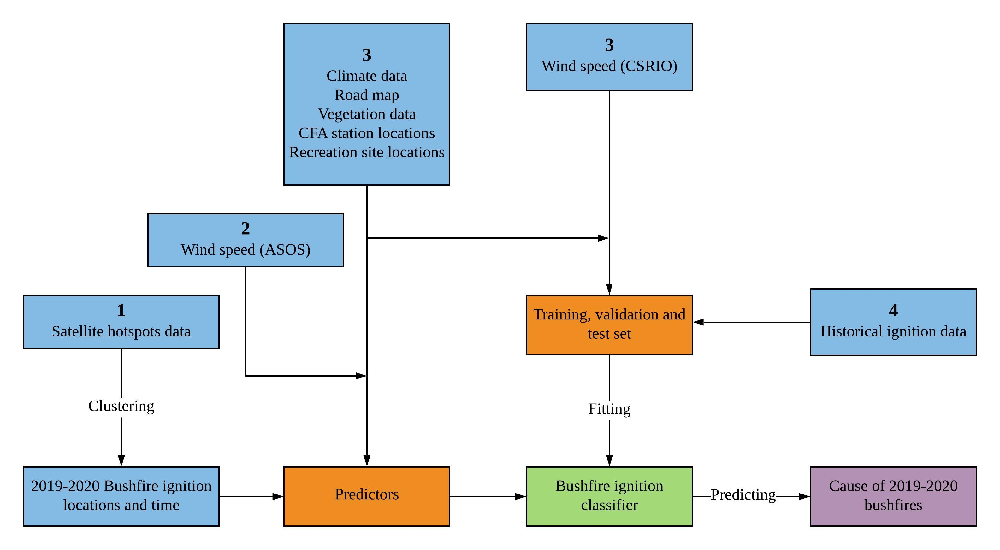

# Data {#ch:data}

## Data sources

One of the focuses of this work is to utilise open data, and collates these datasets to provide a data fusion with which to tackle the research questions. The motivating data source is satellite hotspots, which is different from what has been analysed previously in the literature. This data is collated with weather records, fuel layer, location of roads, fire stations and recreation sites, and causes of historical fire ignitions. The spatial and temporal details of each dataset are provided in Table \ref{tab:datasetinfo}. In addition, the original data types of each dataset are provided in Table \ref{tab:datatype}. In both tables, there is an `Index` column indicates the dataset usage, which will be further discussed in section [3.1.8][Summary of dataset usage]. 

### Satellite hotspot data

To track bushfires in Australia remotely with high temporal and spatial resolution, we use hotspot data taken from the Himawari-8 satellite [@jaxa]. This hotspot data is available on the Japan Aerospace Exploration Agency FTP site. We download only the data from October 2019 to March 2020, and details on how to download this data are provided by @hotspots. The dataset contains records of 1,989,572 hotspots for these six months in the full disk of 140 °east longitude.

### Climate data

To better understand bushfires, we collect climate data from Bureau of Meteorology (**BOM**) and Commonwealth Scientific and Industrial Research Organisation (**CSIRO**). Weather properties including maximum temperature, minimum temperature, rainfall and solar exposure are retrieved via an open source R package `bomrang` [@R-bomrang], which is a data client of **BOM**. Historical weather records of 885 weather stations across Australia from January 1863 to April 2020 are downloaded. However, the number of publicly available climate attributes on **BOM** are limited. In order to maintain the coherent reproducible workflows, we download near-surface wind speed grids across Australia from January 1975 to December 2018 from **CSIRO** [@wind] and the station-based wind speed from January 2017 to August 2020 from the Australia Automated Surface Observing System (**ASOS**) network mirrored by Iowa State University [@windasos]. There are only a limited number of **ASOS** stations in Victoria and they are mostly located around Melbourne. Therefore, even though **ASOS** data is also available from 2000-2018, **CSIRO** data is used.

### Road map

Since bushfires can be impacted by anthropogenic factors, we use the road map from the comprehensive open source **OpenStreetMap** [@OpenStreetMap] to represent the reachability of bushfire ignition locations. The road map is one of the layers of the full archive, and consists of 1,797,217 roads belonging to 27 different road classes in Australia. 

### Fuel layer

Vegetation information is obtained from a 2018 nationwide forest dataset compiled by @forest. This is the fifth and the latest national State of the Forest Report (**SOFR**). Previous national **SOFR**s were published in 1998-2013 and superseded.

### Fire stations

Data of Country Fire Authority (**CFA**) fire stations are retrieved from @cfa. It contains 52,716 Victorian topographic features, including rivers, water bodies, transport, facilities and fire stations.

### Recreation sites

Camping activities may be associated with accidental human-caused bushfires. Therefore, we download Victorian recreation sites from @recreation. The dataset contains 417 camping locations in Victoria. 

### Fire origins

We use the Victorian Department of Environment, Land, Water and Planning (**DELWP**) Fire Origins dataset to obtain historical bushfire ignition locations and causes [-@fireorigin]. This dataset provides each first reported location of the fire recorded by crews rather than the exact origin of the fire, which can be considered as a great approximation of ignition points. 


### Summary of dataset usage

In Table \ref{tab:datasetinfo} and Table \ref{tab:datatype}, column `Index` indicates different usage for datasets in this research. `1` is the satellite hotspot data, `2` is the wind speed data retrieved from **ASOS**, `3` are supplementary datasets and `4` is the historical bushfire ignition data.

`1` is used in spatio-temporal clustering algorithm to identify ignition location and time. `3` combined with `4` are used as training, validation and test set to build a bushfire ignition classifier. `2` and `3` combined with the clustering results are used as predictors to predict the cause of bushfire ignitions in Victoria during the 2019-2020 season. 

The summary of dataset usage and research workflow is provided in Figure \ref{fig:datasummary}.

{width=550 height=261}


```{r datasets, results='asis'}
library(kableExtra)
library(tidyverse)
datasets_info = data.frame(index = c(1,2,3,3,3,3,3,3,4),
                           name = c("Himawari-8 satellite hotspot data",
                                    "Australia ASOS - wind speed",
                                    "Bureau of Meteorology climate data",
                                    "CSIRO - near-surface wind speed",
                                    "Openstreetmap - road map",
                                    "Forest of Australia - fuel layer",
                                    "Victorian CFA fire stations",
                                    "Victorian recreation sites",
                                    "Vicotiran fire origins"), 
                           spatialresolution = c("$0.02^\\circ \\approx 2km$",
                                                 "mph",
                                                 "",
                                                 "$2^\\circ \\approx 200km$",
                                                 "2m",
                                                 "100m",
                                                 "20m",
                                                 "10m",
                                                 "100m"), 
                           temporalresolution = c("Per 10 minutes",
                                                  "Hourly",
                                                  "Daily",
                                                  "Daily",
                                                  "",
                                                  "",
                                                  "",
                                                  "",
                                                  "Daily"),
                           time = c("2019-2020",
                                    "2017-2020",
                                    "1863-2020",
                                    "1975-2018",
                                    "2020",
                                    "2018",
                                    "2020",
                                    "2020",
                                    "1972-2018"))

knitr::kable(datasets_info, 'latex', 
             caption  = 'Raw data information', 
             label = "datasetinfo",
             booktabs = TRUE,
             col.names = c("Index", "Data set name", "Spatial Resolution", "Temporal resolution", "Time"),
             escape = FALSE) %>%
  row_spec(c(1, 2, 8), hline_after = T) %>%
  kable_styling(latex_options = "scale_down")

```

```{r}
datasets_info = data.frame(index = c(1,2,3,3,3,3,3,3,4),
                           name = c("Himawari-8 satellite hotspot data",
                                    "Australia ASOS - wind speed",
                                    "Bureau of Meteorology climate data",
                                    "CSIRO - near-surface wind speed",
                                    "Openstreetmap - road map",
                                    "Forest of Australia - fuel layer",
                                    "Victorian CFA fire stations",
                                    "Victorian recreation sites",
                                    "Vicotiran fire origins"), 
                           type = c("Comma separated values file",
                                    "Comma separated values file",
                                                 "Comma separated values file",
                                                 "Binary raster file",
                                                 "Shapefile - LINESTRING",
                                                 "Amiga disk file",
                                                 "Shapefile - POINT",
                                                 "Shapefile - POINT",
                                                 "Shapefile - POINT"), 
                           files = c("6",
                                     "1",
                                                  "1",
                                                  "16070",
                                                  "1",
                                                  "1",
                                                  "1",
                                                  "1",
                                                  "1"),
                           size = c("908",
                                    "25",
                                    "740",
                                    "384",
                                    "2078",
                                    "125",
                                    "30",
                                    "2.5",
                                    "22"))

knitr::kable(datasets_info, 'latex', 
             caption  = 'Raw data types', 
             label = "datatype",
             booktabs = TRUE,
             col.names = c("Index", "Dataset name", "Type", "Files", "Total size (MB)"),
             escape = FALSE) %>%
  row_spec(c(1, 2, 8), hline_after = T) %>%
  kable_styling(latex_options = "scale_down")
```


## Data processing for historical bushfire ignitions


The programming language we use to perform data manipulation for this research is `R` [@R]. Victorian historical fire origins, recreation sites, **CFA** fire stations and the road map are geospatial data in the shapefile format, which are processed using the tools in `sf` [@R-sf]. Fuel layer and near-surface wind speed are also geospatial data but are stored in the grid format. We use tools in `raster` [@R-raster] to manipulate the data. Other datasets including satellite hotspot data and **BOM** climate data are stored in csv format, which can be handled using the package `tidyverse` [@R-tidyverse].

We only keep historical fire origins since 2000 due to the limitation of other supplementary datasets. We drop all cases with unknown cause from the dataset under the assumption that the major causes distributed in the same way in cases with unknown causes. Given the dataset contains fires other than bushfires, we drop non-bushfire cases based on their cause. Fires caused by reasons including "WASTE DISPOSAL", "BURNING BUILDING" and "BURNING VEHICLE" are not considered as bushfires. Causes of fire are then recategorized into 5 classes, including lightning, accident, arson, burning off and others.  We end up having very few cases in others (0.9%) which motivates us to drop it.

**BOM** weather records including maximum temperature, minimum temperature, solar exposure and rainfall are station-based data. Weather stations are distributed unevenly across Victoria and are often under maintenance. Therefore, we match every historical fire origin to its 10 nearest weather stations, and then extracted the nearest non-missing daily weather metrics. Differently, **CSIRO** wind speed data provides us with a full grid of values in Victoria. Therefore, we project historical fire origins onto their corresponding gird entries to extract the daily average wind speed. Finally, weather metrics in the past 720 days for every historical fire origin are summarised into several numeric variables which can be found in the Appendix.

Besides, **CFA** stations locations are filtered from the raw data by matching the `FEATSUBTYP` field equal to "fire station". Natural logarithm of the distance to the nearest recreation site, fire station and road are computed for every historical fire origin.

Vegetation information included vegetation type, height and cover are stored in the grid format which is extracted in the same way as the **CSIRO** wind speed data. 

We also truncate hotspot data by using a recommended threshold of fire power [@hotspots], which is over 100 (irradiance over 100 watts per square metre), to reduce noise from the background, and then select the hotspots within the boundary of Victoria. The further steps of data processing for hotspot data including clustering and joining with other covariates will be introduced in chapter \ref{ch:STHC}.


## Compiled data

The end result of the data cleaning is two different datasets. One is the compiled dataset used for model fitting which contains 9369 observations and 55 fields, including a field representing the cause of the bushfire ignition. The other is the satellite hotspot data for clustering, which contains 75,936 observations and four fields: unique identifier, longitude, latitude and time.

Covariates for fitting the ignition classifier include month, day, day of the week, longitude, latitude, forest type, forest crown cover, forest height, rainfall in the past 2 years, wind speed in the past 2 years, temperature in the past 2 years, solar exposure in the past 2 years, as well as natural logarithm of proximities to the nearest fire station, recreation site and road. Additional details about the covariate information can be found in the Appendix. 


## Exploratory data analysis of historical bushfire ignitions

By performing the exploratory data analysis on the historical bushfire ignitions, we explore the relationship between covariates and causes of ignition.

From January 2000 to December 2018, Victoria recorded 3886, 3173, 1627 and 683 bushfire ignitions caused by lightning, accident, arson and burning off, respectively. The histogram of ignition cause is given in (A) of Figure \ref{fig:causehist}. We compare the observed distribution of causes of bushfires to that proposed by @beale2011preventing. Ignitions caused by arson were significantly less than the data provided in their review (17% vs. 50%), while lightning-caused ignitions taking a greater percentage (41% vs. 6%). 

There was an abnormal increasing trend of accident-caused ignition over the recent years which is shown in (B) of Figure \ref{fig:causehist}. In addition, from (C) of Figure \ref{fig:causehist}, we find that lightning-caused ignitions were most likely occurred in January and February, which were the hottest months in Victoria. It indicates that lightning-caused ignitions were related to temperature. Moreover, according to (D) of Figure \ref{fig:causehist}, people were careless in managing fire risk on Sunday and in the first two days of the week.

![Histogram (A) and bar plots of four different causes of historical fire ignitions in Victoria by year (B), month (C) and day of the week (D). (A) Lightning and accident were the two main sources of bushfire ignitions, which took up 41% and 34% respectively. The proportion of ignitions caused by arson was around 17%. 7% of ignitions were reported as planned burns. (B) Accident-caused ignitions increased significantly since 2012. Meanwhile, there were only a few cases in 2011, which was because the 2011-2012 bushfire season mainly affected Western Australia instead of Victoria. (C) January was the most serious month in the bushfire season throughout these years. Besides, lightning-caused ignitions usually occurred in the hottest months. (D) Ignitions were almost equally likely to occur on every day of the week. However, accident-caused ignitions were more often on Sunday, Monday and Tuesday. \label{fig:causehist}](figures/overall_summary.png){width=560 height=420}

In Figure \ref{fig:twod}, lightning-caused ignitions were more likely to occur in the mountain area of Victoria and human-caused ignitions were closer to the urban area. It suggests that spatial pattern might be useful in ignition method classification.

{width=560 height=420}

According to the density plot of 1-year average wind speed shown in the upper left of Figure \ref{fig:aws_m12}, the slower yearly wind speed was an indicator of lightning-caused ignitions in contrast to ignitions caused by other sources. In the upper right of the same figure, we find that lightning-caused ignitions were far from the nearest fire station and arson-caused ignitions were closer to the nearest fire station. It was potentially because the population density around the fire station was larger. Besides, lightning-caused ignitions were less reachable shown in the bottom right of Figure \ref{fig:aws_m12}. Furthermore, in the bottom left of figure, accident-caused ignitions were significantly close to recreation sites, which suggests that camp fire was a source of bushfire ignitions.

![Density plot of 1-year average wind speed (Upper left), log distance to the nearest CFA station (Upper right), log distance to the nearest recreation site (Bottom left) and log distance to the nearest road (Bottom right). (Upper left) Wind speed was one of the key factors to classify different types of bushfire ignitions. Lightning-caused ignitions were more likely to occur in windless years. (Upper right) Arson-caused ignitions were closer to fire stations. In contrast, lightning-caused ignitions were far from the fire stations since they often occurred in the mountain area. (Bottom left) Accident-caused ignitions were very likely due to camp fire. (Bottom right) Lightning-caused ignitions were significantly less reachable, which could cause difficulties to fight them.  \label{fig:aws_m12}](figures/overall_density.png){width=560 height=420}


