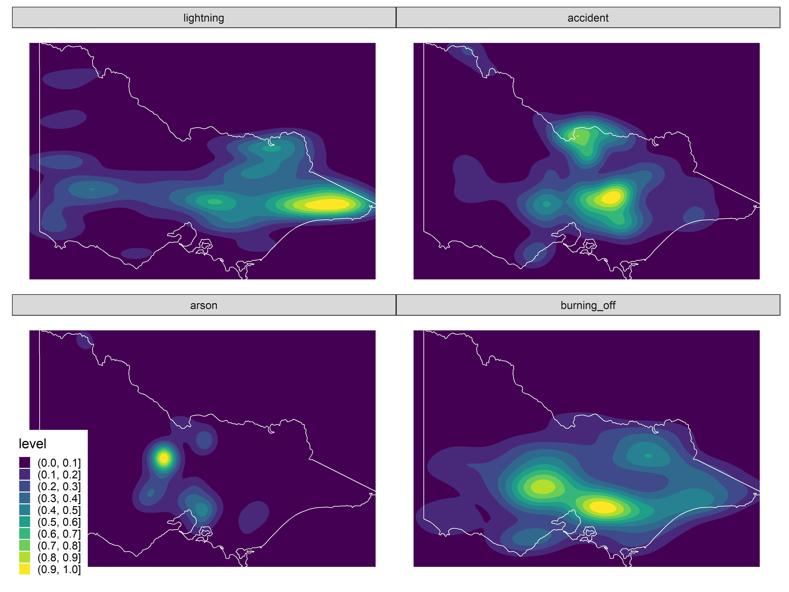
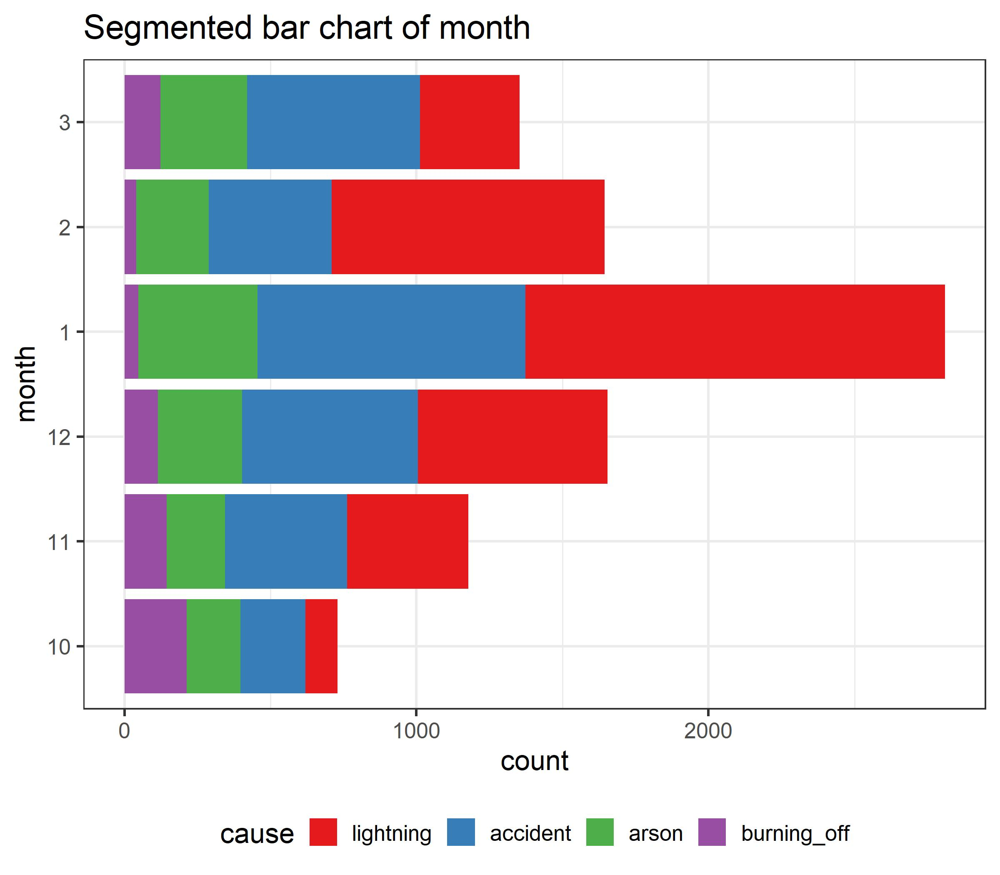
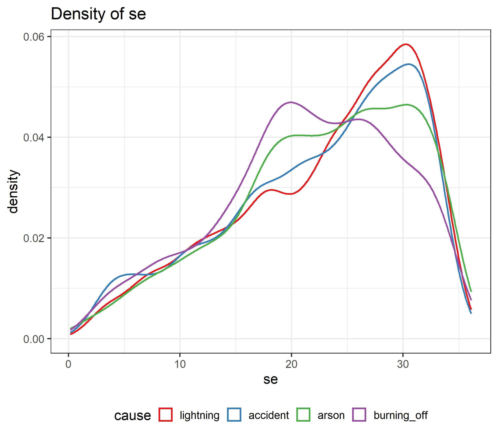
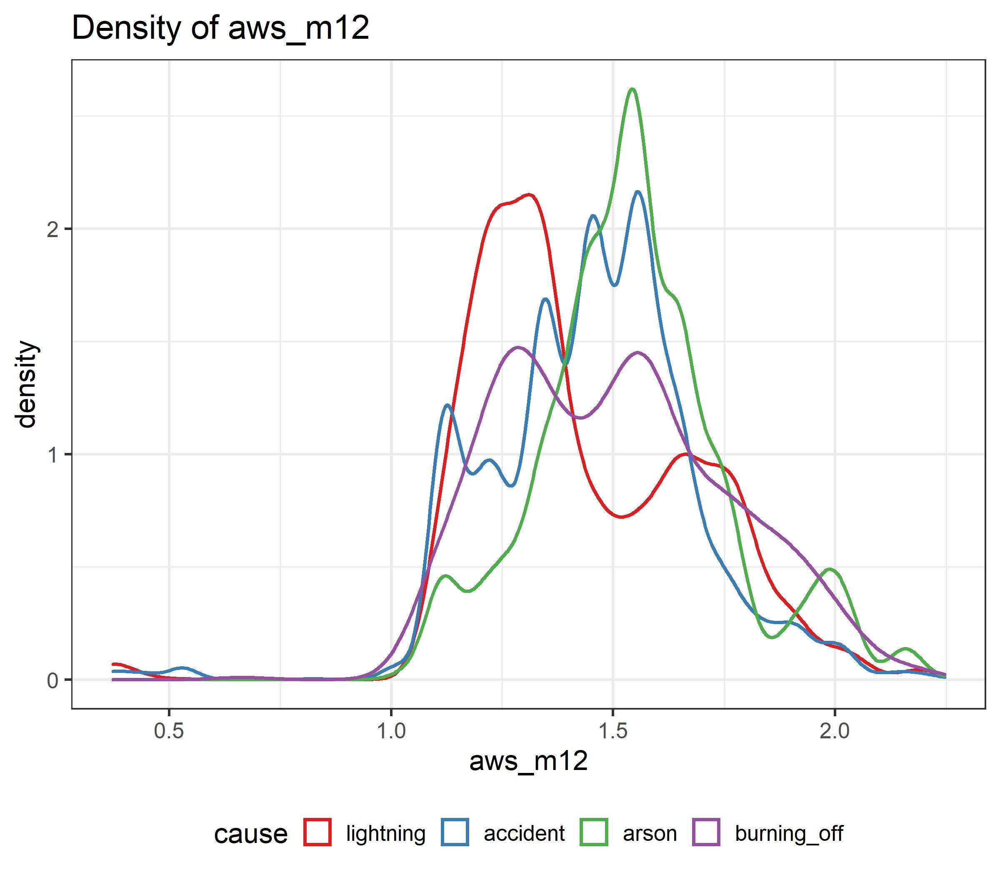
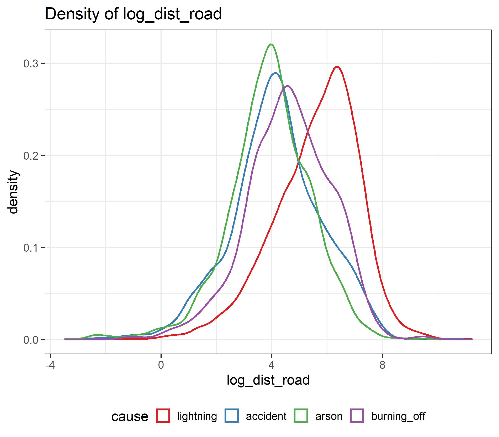
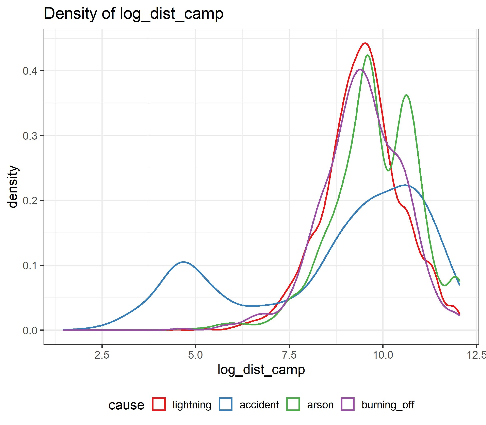

# Data {#ch:data}

## Data Source

A focus of this work is to utilise open-source data, and collate these data sets to provide a data fusion with which to tackle the research questions. The motivating data source is satellite hotspots, which is different from what has been analysed previously in the literature. This data is collated with weather records, fuel layer, location of roads, fire stations and recreation sites, and historical data on cause of ignitions. The spatial and temporal details of each dataset are provided in Table \ref{tab:datasetinfo}. In addition, the original data types of each dataset are provided in Table \ref{tab:datatype}. In both tables, there is an `Index` column indicate the dataset usage, which will be further discussed in section [4.1.8][Summary of dataset usage]. 

### Satellite hotspots data

To track bushfires in Australia remotely with high temporal and spatial resolution, we used hotspots data taken from the Himawari-8 satellite [@jaxa]. The hotspots data was available on the JAXA FTP site. Besides, only the data from October 2019 to March 2020 was downloaded. Details on how to download this data are provided by @hotspots. It contained records of 1989572 hotspots for 5 months in the full disk of 140 °east longitude.

### Climate data

To better understand bushfires, we collected climate data from Bureau of Meteorology (BOM) and Commonwealth Scientific and Industrial Research Organisation (CSRIO). Weather properties including maximum temperature, minimum temperature, rainfall and solar exposure were retrieved via an open-source R package `bomrang` [@R-bomrang], which was a data client of BOM. Historical weather records of 885 weather stations across Australia from January 1863 to April 2020 were downloaded. However, the number of public access climate attributes on BOM were limited. To maintain the coherent reproducible workflows, we decided to download near-surface wind speed grids across Australia from CSRIO [@wind]. Wind speed data from January 1975 to December 2018 were downloaded.

### Road map

Bushfires were impacted by anthropogenic factors, we used road map from a comprehensive open-source map `Openstreetmap` [@OpenStreetMap] to represent the reachability of ignition locations. The road map is one of the layers of the full archive, which consisted of 1797217 roads belonging to 27 different classes in Australia. 

### Fuel layer

Vegetation information was obtained by using a 2018 nationwide forest dataset compiled by @forest. This was the fifth and the latest national State of the Forest Report (SOFR). Previous national SOFRs were published in 1998-2013.

### Fire stations

Data of Country Fire Authority (CFA) fire stations were retrieved from @cfa. It contained 52716 Victorian topographic features including rivers, water bodies, transport, facilities and fire stations.

### Recreation sites

Camping activities could be associated with accidental human-caused bushfires. Therefore, we downloaded Victorian recreation sites from @recreation. The dataset contained 417 camping locations in Victoria. 

### Fire origins

We used the Victorian Department of Environment, Land, Water and Planning (DELWP) Fire Origins dataset for bushfire locations and ignition causes [-@fireorigin]. This dataset provides first reported location of fires recorded by crews rather than origins of a fire, which can be considered as a great approximation of ignition points. 


### Summary of dataset usage

In Table \ref{tab:datasetinfo} and Table \ref{tab:datatype}, column `Index` indicate different usage for datasets in this research. `1` is the satellite hotspots data, `2` are supplementary datasets and `3` is the historical ignition data.

`1` was used in spatio-temporal clustering algorithm to identify ignition location and time. `2` combined with `3` were used as training, validation and test set to build a bushfires ignition classifier. `2` combined with the clustering results were used as predictors to predict the ignition causes of 2019-2020 bushfires. Finally, `1` combined with `2` were used as training, validation and test set in the fire risk model.

The summary of dataset usage and research workflow is provided in Figure \ref{fig:datasummary}.

{width=550 height=261}

```{r datasets, results='asis'}
library(kableExtra)
library(tidyverse)
datasets_info = data.frame(index = c(1,2,2,2,2,2,2,3),
                           name = c("Himawari-8 satellite hotspots data",
                                    "Bureau of Meteorology climate data",
                                    "CSRIO - near-surface wind speed",
                                    "Openstreetmap - road map",
                                    "Forest of Australia - fuel layer",
                                    "Victorian CFA fire stations",
                                    "Victorian recreation sites",
                                    "Vicotiran fire origins"), 
                           spatialresolution = c("$0.02^\\circ \\approx 2km$",
                                                 "",
                                                 "$2^\\circ \\approx 200km$",
                                                 "2m",
                                                 "100m",
                                                 "20m",
                                                 "10m",
                                                 "100m"), 
                           temporalresolution = c("Per 10 minutes",
                                                  "Daily",
                                                  "Daily",
                                                  "",
                                                  "",
                                                  "",
                                                  "",
                                                  "Daily"),
                           time = c("2019-2020",
                                    "1863-2020",
                                    "1975-2018",
                                    "2020",
                                    "2018",
                                    "2020",
                                    "2020",
                                    "1972-2018"))

knitr::kable(datasets_info, 'latex', 
             caption  = 'Raw data information', 
             label = "datasetinfo",
             booktabs = TRUE,
             col.names = c("Index", "Data set name", "Spatial Resolution", "Temporal resolution", "Time"),
             escape = FALSE) %>%
  row_spec(c(1, 7), hline_after = T) %>%
  kable_styling(latex_options = "scale_down")

```

```{r}
datasets_info = data.frame(index = c(1,2,2,2,2,2,2,3),
                           name = c("Himawari-8 satellite hotspots data",
                                    "Bureau of Meteorology climate data",
                                    "CSRIO - near-surface wind speed",
                                    "Openstreetmap - road map",
                                    "Forest of Australia - fuel layer",
                                    "Victorian CFA fire stations",
                                    "Victorian recreation sites",
                                    "Vicotiran fire origins"), 
                           type = c("Comma separated values file",
                                                 "Comma separated values file",
                                                 "Binary raster file",
                                                 "Shapefile - LINESTRING",
                                                 "Amiga disk file",
                                                 "Shapefile - POINT",
                                                 "Shapefile - POINT",
                                                 "Shapefile - POINT"), 
                           files = c("6",
                                                  "1",
                                                  "16070",
                                                  "1",
                                                  "1",
                                                  "1",
                                                  "1",
                                                  "1"),
                           size = c("908",
                                    "740",
                                    "384",
                                    "2078",
                                    "125",
                                    "30",
                                    "2.5",
                                    "22"))

knitr::kable(datasets_info, 'latex', 
             caption  = 'Raw data types', 
             label = "datatype",
             booktabs = TRUE,
             col.names = c("Index", "Dataset name", "Type", "Files", "Total size (MB)"),
             escape = FALSE) %>%
  row_spec(c(1, 7), hline_after = T) %>%
  kable_styling(latex_options = "scale_down")
```


## Data processing


### Data manipulation

The programming language used to perform data manipulation in this research is `R` [@R]. Victorian fire origins, recreation sites, CFA fire stations and road map were geospatial data in the shapefile format, which could be processed using the tools in `sf` [@R-sf]. Fuel layer and near-surface wind speed are also geospatial data but stored in the grid format. We used tools in `raster` [@R-raster] to manipulate the data. Other datasets including satellite hotspots data and BOM climate data were stored in csv format which could be handled using the package `tidyverse` [@R-tidyverse].

We only kept fire origins since 2000 due to the limitation of other supplementary datasets. Fire origins were then filtered by the fuel layer to drop fire ignitions in non forest area. Causes of fire were recategorized into 5 classes, including lightning, accident, arson, burning off and others.


Weather records including maximum temperature, minimum temperature, solar exposure, rainfall and wind speed in the past 720 days for each fire origin were summarised into several numeric variables which are provided in Table \ref{tab:cov}. Besides, CFA stations locations were filtered from the raw data by matching the `FEATSUBTYP` field equal to "fire station". 

Distance to the nearest recreation site, fire station and road were computed for each fire origin.

We truncated hotspots data by using a recommended threshold of fire power [@hotspots], which was over 100 (irradiance over 100 watts per square metre), to reduce noise from the background. 


### Identifying unique fires using spatiotemporal clustering


Since there was no available algorithm and software for hotspots clustering, a clustering algorithm and implementation were developed to group hotspots into unique fires. The details are in Table \ref{tab:clustering} in the Appendix. Each hotspot will be assigned a cluster membership which is called the *fire_id*. Other characteristics of each fire, including its centroid, starting time, ending time and movement are recorded. The motivation for this algorithm is bushfire dynamics which can be summarised using two parameters, the potential distance a fire can spread in an hour, and the time a fire can stay smouldering but undetectable by satellite before flaring up again, represented by $r_0$ and $t_0$, respectively. These two parameters have been used to determine if a new hotspot belongs to an existing or new cluster.

Figure \ref{fig:mov} shows two fires and their lifetime movement as computed by the algorithm. 


![The movement path and hotspots map shows the bushfire behaviour of bushfire "454" and bushfire "1420", which is two clusters from the results of the clustering algorithm. The triangle is the ignition point of bushfire and the rectangle is the extinguish point. The black line is the movement of bushfire centroid. Points with red colour and larger size are hotspots with higher fire power which is measured by watt per square metre. We can know that bushfires ignited with low fire power, and will get hotter when time pass, then finally extinguish with not enough fuel. \label{fig:mov}](figures/fire_mov.jpg){width=550px height=495px}

## Compiled data

The end results of the data cleaning are three different datasets, which are the dataset for fitting the ignition classifier, the dataset for predicting the 2019-2020 bushfires causes with the ignition classifier and the dataset for fitting the fire risk model. 

The covariate information for fitting the ignition classifier and the fire risk model can be found in Table \ref{tab:cov} and Table <haven't finished yet> respectively.


\footnotesize

```{r}
datasets_info = data.frame(index = c("year",
                                     "month",
                                     "day",
                                     "dow",
                                     "lon",
                                     "lat",
                                     "FOR_TYPE",
                                     "FOR_CAT",
                                     "COVER",
                                     "HEIGHT",
                                     "rf",
                                     "rf7",
                                     "arf14",
                                     "arf28",
                                     "arf60",
                                     "arf90",
                                     "arf180",
                                     "arf360",
                                     "arf720",
                                     "se",
                                     "ase7",
                                     "ase14",
                                     "ase28",
                                     "ase60",
                                     "ase90",
                                     "ase180",
                                     "ase360",
                                     "ase720",
                                     "maxt",
                                     "amaxt7",
                                     "amaxt14",
                                     "amaxt28",
                                     "amaxt60",
                                     "amaxt90",
                                     "amaxt180",
                                     "amaxt360",
                                     "amaxt720",
                                     "mint",
                                     "amint7",
                                     "amint14",
                                     "amint28",
                                     "amint60",
                                     "amint90",
                                     "amint180",
                                     "amint360",
                                     "amint720",
                                     "ws",
                                     "aws_m0",
                                     "aws_m1",
                                     "aws_m3",
                                     "aws_m6",
                                     "aws_m12",
                                     "aws_m24",
                                     "dist_cfa",
                                     "dist_camp",
                                     "dist_road"),
                           name = c("Year",
                                    "Month",
                                    "Day",
                                    "Day of the week. 1-7",
                                    "Longitude",
                                    "Latitude",
                                    "Forest type. Eg. Acacia, Callitris, Casuarina, etc.",
                                    "Forest category. Native forest, Commercial plantation or Other forest",
                                    "Forest crown cover. 1-6. Check COVER look up table",
                                    "Forest height class. 1-6. Check HEIGHT look up table",
                                    "Rainfall on that day",
                                    "Average rainfall in past 7 days",
                                    "Average rainfall in past 14 days",
                                    "Average rainfall in past 28 days",
                                    "Average rainfall in past 60 days",
                                    "Average rainfall in past 90 days",
                                    "Average rainfall in past 180 days",
                                    "Average rainfall in past 360 days",
                                    "Average rainfall in past 720 days",
                                    "Global solar exposure on that day",
                                    "Average global solar exposure in past 7 days",
                                    "Average global solar exposure in past 14 days",
                                    "Average global solar exposure in past 28 days",
                                    "Average global solar exposure in past 60 days",
                                    "Average global solar exposure in past 90 days",
                                    "Average global solar exposure in past 180 days",
                                    "Average global solar exposure in past 360 days",
                                    "Average global solar exposure in past 720 days",
                                    "Maximum temperature on that day",
                                    "Average maximum temperature in past 7 days",
                                    "Average maximum temperature in past 14 days",
                                    "Average maximum temperature in past 28 days",
                                    "Average maximum temperature in past 60 days",
                                    "Average maximum temperature in past 90 days",
                                    "Average maximum temperature in past 180 days",
                                    "Average maximum temperature in past 360 days",
                                    "Average maximum temperature in past 720 days",
                                    "Minimum temperature on that day",
                                    "Average minimum temperature in past 7 days",
                                    "Average minimum temperature in past 14 days",
                                    "Average minimum temperature in past 28 days",
                                    "Average minimum temperature in past 60 days",
                                    "Average minimum temperature in past 90 days",
                                    "Average minimum temperature in past 180 days",
                                    "Average minimum temperature in past 360 days",
                                    "Average minimum temperature in past 720 days",
                                    "Average wind speed on that day",
                                    "Average wind speed on that month",
                                    "Average wind speed in last month",
                                    "Average wind speed in last 3 months",
                                    "Average wind speed in last 6 months",
                                    "Average wind speed in last 12 months",
                                    "Average wind speed in last 24 months",
                                    "Distance to the nearest CFA station",
                                    "Distance to the nearest recreation site",
                                    "Distance to the nearest road"), 
                           type = c("",
                                     "",
                                     "",
                                     "",
                                     "degrees",
                                     "degrees",
                                     "",
                                     "",
                                     "",
                                     "",
                                     "mm",
                                     "mm",
                                     "mm",
                                     "mm",
                                     "mm",
                                     "mm",
                                     "mm",
                                     "mm",
                                     "mm",
                                     "MJ/m^2",
                                     "MJ/m^2",
                                     "MJ/m^2",
                                     "MJ/m^2",
                                     "MJ/m^2",
                                     "MJ/m^2",
                                     "MJ/m^2",
                                     "MJ/m^2",
                                     "MJ/m^2",
                                     "Celsius degree",
                                     "Celsius degree",
                                     "Celsius degree",
                                     "Celsius degree",
                                     "Celsius degree",
                                     "Celsius degree",
                                     "Celsius degree",
                                     "Celsius degree",
                                     "Celsius degree",
                                     "Celsius degree",
                                     "Celsius degree",
                                     "Celsius degree",
                                     "Celsius degree",
                                     "Celsius degree",
                                     "Celsius degree",
                                     "Celsius degree",
                                     "Celsius degree",
                                     "Celsius degree",
                                     "m/s",
                                     "m/s",
                                     "m/s",
                                     "m/s",
                                     "m/s",
                                     "m/s",
                                     "m/s",
                                     "m",
                                     "m",
                                     "m"))

knitr::kable(datasets_info, 'latex', 
             caption  = 'Covariate information of the ignition classifier', 
             label = "cov",
             booktabs = TRUE,
             longtable = T,
             col.names = c("Covariate name", "description", "Units"))  %>%
kable_styling(latex_options = c("repeat_header"))

  
```

\normalsize

(ref:clutforest) COVER look up table [@forest]
(ref:hlutforest) HEIGHT look up table [@forest]

```{r results='asis'}
tibble(COVER = c(1,2,3,4,5,6), Forest = c("20-50%", "50-80%", ">80%", "n/a", ">=20%", "<20%"), des = c("Woodland", "Open", "Closed", "Plantation", "Unknown", "Non forest")) %>%
  knitr::kable('latex',
               col.names = c("COVER code", "Forest crown cover", "Description"),
               label = "cover",
               caption = '(ref:clutforest)',
               booktabs = T)
```


```{r}
tibble(COVER = c(1,2,3,4,5,6), Forest = c("2m-10m", "10m-30m", ">30m", "n/a", ">=2m", ""), des = c("Low", "Medium", "Tall", "Plantation", "Unknown", "Non forest")) %>%
  knitr::kable('latex',
               col.names = c("HEIGHT code", "Forest height class", "Description"),
               label = "height",
               caption = '(ref:hlutforest)',
               booktabs = T)
```

## Descriptive summary

By performing the exploratory data analysis on the historical bushfire ignitions, we explored the relationship between covariates and cause of ignition.

### Summary of ignition cause

From January 2000 to December 2018, Victoria recorded 3335, 3322, 1315, 665 and 1508 bushfires ignitions caused by lightning, accident, arson, burning off and others respectively. The histogram of ignition cause is given in Figure \ref{fig:causehist}. The proportion of each cause was against the review of bushfires proposed by @beale2011preventing. Ignitions caused by arson were significantly less than the data provided in their review, while lightning-caused ignitions taking a greater percentage. 

{width=275 height=241}

### Map view of bushfire ignitions

In Figure \ref{fig:twod}, lightning-caused ignitions were more likely to occur in the mountain area of Victoria and human-caused ignitions were closer to the urban area. It suggested that spatial pattern would be useful in ignition classification.

{width=550 height=275}

### Temporal characteristics of bushfire ignitions

There was an increasing trend of accident-caused ignition over the recent years which was shown in Figure \ref{fig:year}. In addition, we found that in Figure \ref{fig:month}, lightning-caused ignitions were most likely occurred in January and February, which were the hottest months in Victoria. It indicated that lightning-caused ignitions were related to temperature. Moreover, according to Figure \ref{fig:day}, people were careless in managing fire risk on Sunday and in the first two days of the week.

{width=275 height=241}

{width=275 height=241}


{width=275 height=241}


### Climate condition of bushfire ignitions

We investigated a series of climate variables given in Table \ref{tab:cov}. Some findings had been discovered. From the density plot of global solar exposure shown in \ref{fig:se}, we found that lightning-caused ignitions occurred on days with higher solar exposure while planned burns usually occurring on cloudy days. In addition, according to the density plot of average wind speed in the past 12 months shown in Figure \ref{fig:aws_m12}, the slower yearly wind speed was an indicator of lightning-caused ignitions in contrast to accident-caused ignitions.

{width=275 height=241}

{width=275 height=241}


### Anthropogenic characteristics of bushfire ignitions

To understand the relationship between anthropogenic factors and bushfire ignitions, we explored density plot of the log distance to the nearest CFA fire station, the log distance to the nearest road and the log distance to the nearest camping site which are shown in Figure \ref{fig:dist_cfa}, Figure \ref{fig:dist_road} and Figure \ref{fig:dist_camp} respectively.

We found that lightning-caused ignitions were far from the nearest fire station and arson-caused ignitions were closer to the nearest fire station. It was potentially because the population density around the fire station was larger. Besides, lightning-caused ignitions were less reachable shown in \ref{fig:dist_road}. Another finding was the density of arson was almost identical to the density of accident. It could indicate that both ignitions caused by arson and accident aligned with the road network. Moreover, according to Figure \ref{fig:dist_camp}, accident-caused ignitions were significantly close to camping sites, which suggested that camp fire was a source of bushfire ignitions.


{width=275 height=241}

{width=275 height=241}

{width=275 height=241}
