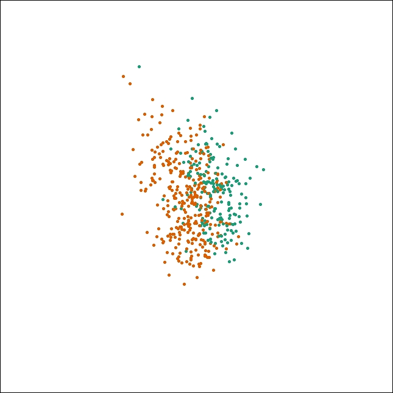
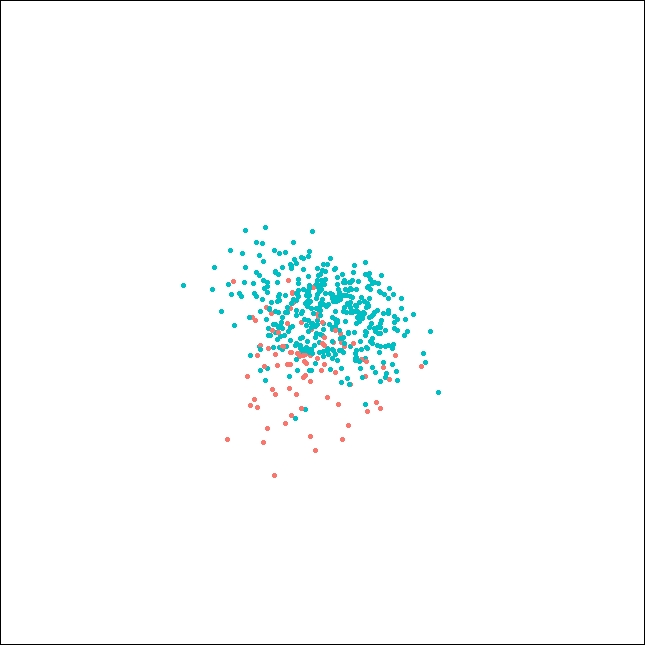

# Bushfire ignition classifier {#ch:classifier}

## Model description

We used a random forest model to classify bushfire ignitions. Random forest was a common machine learning algorithm for building the multi-class classifier. It generated a certain number of decision trees by using the bootstrap aggregating technique and took the majority vote in the case of decision trees as the prediction. In contrast to decision tree, random forest model could potentially reduce overfitting of the training set, and had a built-in variable selection mechanism.

A fitted random forest model, along with covariate data in 2019-2020 bushfire season, can be used to produce the prediction of the likelihood of ignition belong to each class.

Other candidate models we tested were multinomial logit model, generalised additive model, XGBoost and fully-connected artificial neural network. Our research found that random forest was better than all other candidate models in prediction performance.

The random forest algorithm was available in package `randomForest` [@R-rf]. Besides, package `caret` [@R-caret] was used to control the training, feature selection, hyperparameter tuning and candidate model selection process. We randomly selected 80% of total data as training set, and the rest 20% data was test set. 

## Feature selection

We performed variable selection for each candidate model by using the genetic algorithm. Genetic algorithm was an optimization technique to search the desired point in a high-dimensional space. It mimicked the process of evolution by creating a competitive environment and eliminating candidates with low scores in high chance. After generations, the evolved population would be close to the optimal solution we wanted.

We set population size, maximum generations, crossover rate and mutation rate to be 100, 200, 0.8 and 0.1 respectively. Then the algorithm ran on folds of data generated by 10-fold cross-validation of training set. 
The final set of variables being selected for each candidate model can be found in Table <haven't finished yet>.

## Hyperparameter tuning and candidate model selection

The hyperparameter tuning for each candidate model was done by using 10-fold cross-validation grid searching. We set up a grid of potential hyperparameters which is shown in Table <haven't finished yet>, then evaluated their performance cell by cell. The best hyperparameters for each candidate model can be found in Table <haven't finished yet>.

The final selection step was candidate model selection. We compared their performance on the test set. Detail information about their performance can be found in the Appendix. We chose random forest model since it yielded the best score of accuracy. 

## Results

The overall accuracy for our model was 64.79%. The confusion matrix of the ignition classifier is shown in Table \ref{tab:conrf}. It suggested that lightning-caused and accident-caused ignitions could be easily classified from other causes. Meanwhile, there was no clear boundary for arson-caused, burning off and other ignitions. 82.53% of accident-caused and 89.21% of lightning-caused ignitions were correctly recognised by the model, which was a reliable result. In addition, if we only needed to classify human-caused, lightning-caused and other ignitions, the overall accuracy could achieve 74.31%.


```{r}
data.frame(accident = c(548, 29, 6, 69, 12), 
           arson = c(83, 110, 8, 42, 20),
           burning_off = c(43, 24, 28, 27, 11),
           lightning = c(49, 8, 4, 595, 11),
           other = c(114, 28, 10, 116, 33)) %>%
  `row.names<-`(c("predicted_accident", "predicted_arson", "predicted_burning_off", "predicted_lightning", "predicted_other")) %>%
  knitr::kable('latex',
               booktabs = T,
               label = "conrf",
               caption = "Confusion matrix of random forest model. The overall accuracy was 0.6479.")
```


High-dimensional projection produced by guided tour with LDA projection pursuit index [@cook2007interactive] and tools in package `tourr` [@R-tourr] revealed the similar findings. In Figure \ref{fig:ldalightning}, although lightning-caused ignitions could not be fully separate from other points, we could still find a reasonably good classification boundary on this projection. In contrast, it was not possible to find a clear boundary in Figure \ref{fig:ldaarson}, where almost all points mixed together.

{width=275 height=275}

{width=275 height=275}

The scaled variable importance produced by random forest model was the scaled difference between the accuracies while permuting each predictor variable. Table \ref{tab:imp} shows the top 10 most important variables in our ignition classifier. The results suggested that distance to the nearest camping site, road and fire station were the most important variables in ignition classification. Moreover, spatial patterns represented in longitude and latitude also played important roles. Other than that, long-run climate factors were more important than short-term weather variables. This could be due to lightning occurrence were highly related to long-run climate.

```{r}
data.frame(variable = c("dist_camp", "lon", "dist_road", "dist_cfa", "aws_m24", "lat", "amint720", "amaxt720", "aws_m12", "ase720"),
           value = c(100.000000, 94.106333, 89.588010, 71.548548, 58.693536, 55.971651, 49.697372, 48.367001, 46.237199, 46.156306)) %>%
  knitr::kable('latex',
               booktabs = T,
               label = 'imp',
               caption = "Scaled variable importance of random forest model.")
```


## Prediction of 2019-2020 bushfire ignition cause

<haven't finished yet>


