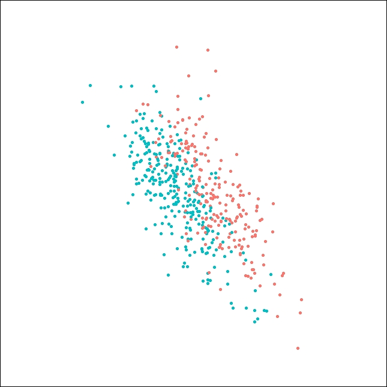

# Classification of ignition causes {#ch:classifier}

## Model description

We use a random forest model to classify historical bushfire ignitions. Random forest [@breiman2001random] is an ensemble learning method for building tree-based prediction models. It is perhaps one of the most regularly used black-box machine learning models in various fields [@boulesteix2012overview; @heung2016overview]. It generates a certain number of decision trees by using the bootstrap aggregating technique and take the majority vote in the case of decision trees as the prediction. In contrast to the decision tree, random forest model can potentially reduce overfitting of the training set and have a built-in variable selection mechanism.

Other candidate models we test in this research are multinomial logit model [@berkson1944application], generalised additive model (GAM) multinomial logistic regression [@yee1996vector] and XGBoost [@chen2016xgboost]. 

Multinomial logit model [@berkson1944application] is the generalization of the logistic regression to multi-class problems, which is commonly used as the baseline model in predictive modelling. 

Generalised additive model [@hastie1990generalized] is a generalised linear model with additive smooths terms in the link function and GAM multinomial logistic regression [@yee1996vector] is its extension to multi-class problems. GAM is relatively popular in the field of bushfire ignition analysis. Some examples are @bates2018exploratory, @read2018lightning and @zhang2017wildfire. 

XGBoost [@chen2016xgboost] is an open-source distributed gradient boosting library. It provides a parallel tree boosting to solve complex regression and classification problems efficiently. Gradient boosting [@gboost] is an important technique in machine learning, which belongs to the class of boosting algorithms. It is a method to build a strong learner, which often referred to as an ensemble model, by aggregating a set of week learners iteratively. Numerous competitions, for example, the Higgs boson machine learning challenge [@adam2015higgs] and the Global energy forecasting competition 2012 [@hong2014global], have shown that XGBoost is one of the dominant methods in building prediction models on structured data.


In this research, the model building process includes feature selection, hyperparameter tuning and candidate model selection. 

The multinomial logit model, generalised additive model, random forest and XGboost are available in package `nnet` [@R-nnet], `mgcv` [@R-mgcv], `randomForest` [@R-rf] and `xgboost` [@R-xgboost] respectively. Besides, package `lime` [@R-lime] is used to perform feature selection and package `caret` [@R-caret] is used to control the training, hyperparameter tuning and candidate model selection process. 

In terms of the train-test split, we randomly select 80% of total data as the training set, and the rest 20% data is test set. The total number of training samples is 7497 and the total number of test samples is 1872. Within the 1872 test samples, we further randomly select 100 samples for feature selection. Thus, the number of remaining samples in the test set is 1772.


## Feature selection


In feature selection, a reasonable principle is to select the most important features. Concerning the variable importance, @strobl2007bias in their research has shown that the global variable importance, particularly random forest variable importance, can be bias and misleading. Unlike the global variable importance provided by many other packages, the package `lime` [@lime] provides the local variable importance under the assumption that machine learning models are linear at the local scope. 

Given an observation, `lime` will randomly sample data points around the predictors, and obtain their predictions by passing them into the black-box model. It will then fit a simple model, typically a ridge regression [@hoerl1970ridge] or a lasso regression [@tibshirani1996regression], using these data points. Due to the characteristic of the lasso regression, it is possible to select the most important variables based on the regularization path. By repeating this process for large enough observations, variables being frequently selected are the most important variables. Figure \ref{fig:limeex} is an example of the result produced by `lime`.

The strategic used in this research to perform feature selection is first fitting and tuning a full model with all covariates using 3-fold cross-validation grid searching controlled by `caret` [@R-caret], then passing in 100 observations for `lime` to find the top 10 most important variables. The final set of variables selected for each candidate model is given in Table \ref{tab:limemost}. From the result, we find the characteristics of different candidate models in ignition method classification. Simpler models, such as the multinomial logistic regression model and the GAM multinomial logistic regression model are preferred to use climate covariates, while the random forest model and the XGBoost model rely on ignition location and anthropogenic covariates.

```{r limeex, fig.cap="An example of selecting the most important variables for the random forest model with respect to the predicted probability of the bushfire ignited by lightning in 4 cases using `lime`. The feature weight is the weighted importance within a case. In this example, the common feature that influences all observations is latitude (lat)."}

if (!file.exists("data/lime_ex.rds")){
  library(caret)
  set.seed(10086)
  
  # Read in training data
  training <- read_csv("data/training.csv")
  
  training <- training %>%
    filter(!CAUSE %in% c("BURNING BUILDING",
                         "WASTE DISPOSAL, INDUSTRIAL, SAWMILL, TIP",
                         "WASTE DISPOSAL, DOMESTIC",
                         "BURNING VEHICLE, MACHINE",
                         "BURNING BUILDING")) %>%
    filter(new_cause != "other") %>%
    filter(new_cause != "relight")
  
  
  training <- select(training, -c(EVENTID:FIRE_NUM), -id, -CAUSE, -FOREST, -FOR_CODE, -FOR_CAT)
  
  training <- mutate(training,
                     year = factor(year(FIRE_START)),
                     month = factor(month(FIRE_START), levels = c(10,11,12,1,2,3)),
                     day = factor(day(FIRE_START), levels = c(1:31)),
                     wod = factor(wday(FIRE_START), levels = c(1:7)))
  
  training <- filter(training, month %in% c(10,11,12,1,2,3))
  
  training <- na.omit(training)
  
  training <- mutate(training, new_cause = ifelse(new_cause == "accidental_human", "accident", new_cause)) %>%
    mutate(new_cause = ifelse(new_cause == "burning_off_human", "burning_off", new_cause)) %>%
    mutate(new_cause = factor(new_cause)) %>%
    mutate(FOR_TYPE = factor(FOR_TYPE))
  
  training <- na.omit(training)
  
  training <- mutate(training,
                     log_dist_cfa = log(dist_cfa),
                     log_dist_camp = log(dist_camp),
                     log_dist_road = log(dist_road),
                     COVER = factor(COVER),
                     HEIGHT = factor(HEIGHT))
  
  training <- rename(training, cause = new_cause)
  training <- mutate(training,
                     cause = fct_relevel(cause,
                                         "lightning",
                                         "accident",
                                         "arson",
                                         "burning_off"))
  
  training <- na.omit(training)
  
  training <- select(training, -year, -dist_road, -dist_cfa, -dist_camp, -FIRE_START)
  
  inTraining <- createDataPartition(training$cause, p = .8, list = FALSE)[,1]
  train_set <- training[inTraining,]
  test_set  <- training[-inTraining,]
  
  set.seed(123456)
  
  lime_sample <- sample(1:length(test_set$cause), 4)
  
  library(lime)
  
  rf_model <- readRDS("data/RF_model.rds")
  
  explainer <- lime(train_set, rf_model)
  
  explaination <- explain(test_set[lime_sample, ],
                          explainer,
                          n_labels = 4,
                          n_features = 5)
  
  p <- plot_explanations(filter(explaination, label == "lightning"))
  saveRDS(p, file = "data/lime_ex.rds")
  p
} else {
  readRDS("data/lime_ex.rds")
}

```

```{r}
readRDS("data/MNL_best_features.rds") %>%
  select(feature) %>%
  rename("Multinomial logistic regression" = feature) %>%
  bind_cols(readRDS("data/GAM_best_features.rds") %>%
  select(feature) %>%
  rename("GAM multinomial logistic regression" = feature)) %>%
  bind_cols(readRDS("data/RF_best_features.rds") %>%
  select(feature) %>%
  rename("Random forest" = feature)) %>%
  bind_cols(readRDS("data/XGB_best_features.rds") %>%
  select(feature) %>%
  rename("XGBoost" = feature)) %>%
  knitr::kable('latex',
               booktabs = T,
               label = 'limemost',
               caption = "The top 10 most important variables for each candidate model ranked in descending order. Variables on the top are more important. The difference in choices of variables across candidate models can be observed. Random forest and XGBoost exploit the location variables and anthropogenic variables. Vegetation factors are most influential in multinomial logistic regression. Solar exposure and wind speed are most important in GAM multinomial logistic regression. ") %>%
  kableExtra::kable_styling(latex_options = "scale_down")
  
  
  
  
  
  
```


## Hyperparameter tuning and candidate model selection

The hyperparameter tuning for each candidate model was done by using 3-fold cross-validation grid searching controlled by package `caret` [@R-caret]. We set up a grid of potential hyperparameters and evaluate their performance cell by cell. The grid, the definition for each hyperparameter and the optimal hyperparameters is given in the Appendix.

The final step of the modelling is candidate model selection. Model performance is compared by using both prediction accuracy and multi-class AUC. Multi-class AUC is defined by Hand and Till [@hand2001simple] and it is available in package `pROC` [@R-pROC]. This metric generalises the commonly used AUC into multiple class classification problems by averaging pairwise comparison of classes.


## Results

After performing feature selection and parameter tuning, we find that random forest is better than all other candidate models in both prediction accuracy and multi-class AUC. Thus, we choose the random forest model as our final model. Model performance is given in Table \ref{tab:accandauc}. More details about the model performance can be found in the Appendix. 

```{r}
data.frame(model = c("Multinomial logistic regression", "GAM multinomial logistic regression", "Random forest", "XGBoost"), 
           accuracy = c(0.5272, 0.6779, 0.7495, 0.7388),
           auc = c(0.7424, 0.8233, 0.8795, 0.8752)) %>%
    knitr::kable('latex',
               col.names = c("Model", "Accuracy", "Multi-class AUC"),
               label = "accandauc",
               caption = 'Performance of the candidate models. Random forest model is the best in terms of accuracy and multi-class AUC.',
               booktabs = T)
```

The overall accuracy of our model is 74.95%. The confusion matrix of the ignition classifier is shown in Table \ref{tab:conrf}. It suggests that lightning-caused and accident-caused ignitions can be easily classified from other causes. Meanwhile, the model is not very confident with arson and burning off. 77.9% of accident-caused and 90.5% of lightning-caused ignitions are correctly recognised by the model, which is a reliable result. 


```{r}
data.frame(Lightning = c(703, 51, 18, 5, 777), 
           Accident = c(77, 494, 55, 8, 634),
           Arson = c(50, 89, 175, 11, 325),
           Burning_off = c(44, 38, 22, 32, 136),
           Total = c(874, 672, 270, 56, 1872)) %>%
  mutate(Lightning = c(paste0(Lightning[1:4], " (", round(Lightning[1:4]/Lightning[5]*100, 1), "%)" ), paste0(Lightning[5]))) %>%
  mutate(Accident = c(paste0(Accident[1:4], " (", round(Accident[1:4]/Accident[5]*100, 1), "%)" ), paste0(Accident[5]))) %>%
  mutate(Arson = c(paste0(Arson[1:4], " (", round(Arson[1:4]/Arson[5]*100, 1), "%)" ), paste0(Arson[5]))) %>%
  mutate(Burning_off = c(paste0(Burning_off[1:4], " (", round(Burning_off[1:4]/Burning_off[5]*100, 1), "%)" ), paste0(Burning_off[5]))) %>%
  `row.names<-`(c("Prediction:lightning", "Prediction:accident", "Prediction:arson", "Prediction:buring_off", "Total")) %>%
  knitr::kable('latex',
               booktabs = T,
               label = "conrf",
               caption = "Confusion matrix of random forest model. The overall accuracy is 0.7495.") 
```


<!-- High-dimensional projection produced by guided tour with LDA projection pursuit index [@cook2007interactive] and tools in package `tourr` [@R-tourr] reveals the similar findings. In Figure \ref{fig:ldalightning}, although lightning-caused ignitions can not be fully separated from other points, we can still find a reasonably good classification boundary on this projection. In contrast, it is not possible to find a clear boundary in Figure \ref{fig:ldaarson}, where almost all points mixed together. -->

<!-- {width=275 height=275} -->

<!-- {width=275 height=275} -->

Based on the prediction performance of the final model on the test set, we plot a map for error rate to reveal the spatial patterns. The plot is given in Figure \ref{fig:errormap}. From the plot, we can observe that our model correctly predicts most of the cases in the mountain area, which is the east of Victoria. However, it performs worse in the Melbourne region. Besides, our model doesn't fit well on the boundary of the north-west of Victoria.

```{r errormap, fig.cap="The spatial patterns of the error rate of the final model. We omit regions with less than 5 bushfires occurred. Our model makes very few mistakes in the east of Victoria but has a higher error rate near Melbourne."}
  set.seed(10086)
  
  # Read in training data
  training <- read_csv("data/training.csv")
  
  training <- training %>%
    filter(!CAUSE %in% c("BURNING BUILDING",
                         "WASTE DISPOSAL, INDUSTRIAL, SAWMILL, TIP",
                         "WASTE DISPOSAL, DOMESTIC",
                         "BURNING VEHICLE, MACHINE",
                         "BURNING BUILDING")) %>%
    filter(new_cause != "other") %>%
    filter(new_cause != "relight")
  
  
  training <- select(training, -c(EVENTID:FIRE_NUM), -id, -CAUSE, -FOREST, -FOR_CODE, -FOR_CAT)
  
  training <- mutate(training,
                     year = factor(year(FIRE_START)),
                     month = factor(month(FIRE_START), levels = c(10,11,12,1,2,3)),
                     day = factor(day(FIRE_START), levels = c(1:31)),
                     wod = factor(wday(FIRE_START), levels = c(1:7)))
  
  training <- filter(training, month %in% c(10,11,12,1,2,3))
  
  training <- na.omit(training)
  
  training <- mutate(training, new_cause = ifelse(new_cause == "accidental_human", "accident", new_cause)) %>%
    mutate(new_cause = ifelse(new_cause == "burning_off_human", "burning_off", new_cause)) %>%
    mutate(new_cause = factor(new_cause)) %>%
    mutate(FOR_TYPE = factor(FOR_TYPE))
  
  training <- na.omit(training)
  
  training <- mutate(training,
                     log_dist_cfa = log(dist_cfa),
                     log_dist_camp = log(dist_camp),
                     log_dist_road = log(dist_road),
                     COVER = factor(COVER),
                     HEIGHT = factor(HEIGHT))
  
  training <- rename(training, cause = new_cause)
  training <- mutate(training,
                     cause = fct_relevel(cause,
                                         "lightning",
                                         "accident",
                                         "arson",
                                         "burning_off"))
  
  training <- na.omit(training)
  
  training <- select(training, -year, -dist_road, -dist_cfa, -dist_camp, -FIRE_START)
  
  inTraining <- createDataPartition(training$cause, p = .8, list = FALSE)[,1]
  train_set <- training[inTraining,]
  test_set  <- training[-inTraining,]
  
  rf_best_features <- readRDS("data/RF_best_features.rds")
  
  rf_model <- readRDS("data/RF_model.rds")

  
  test_set$error <- predict(rf_model, newdata = test_set) != test_set$cause
  
library(sf)
library(rnaturalearth)
au_map <- ne_states(country = 'Australia', returnclass = 'sf')
vic_map <- au_map[7,]

lat <- seq(34, 39, 0.5)
lat <- -lat
lon <- seq(141, 150, 0.5)

grids <- expand.grid(lat, lon)


rect <- function(x){

  # left top
  lat1 <- x[1]
  lon1 <- x[2]

  # right top
  lat2 <- x[1]
  lon2 <- x[2]+0.5

  # right bottom
  lat3 <- x[1]-0.5
  lon3 <- x[2]+0.5

  # left bottom
  lat4 <- x[1]-0.5
  lon4 <- x[2]

  st_sfc(st_polygon(list(matrix(c(lon1,lat1,lon2,lat2,lon3,lat3,lon4,lat4,lon1,lat1), ncol =2, byrow = TRUE))))

}

rect_list <- apply(grids[1:nrow(grids),],1,rect)

rect_list <- do.call(c, rect_list)

st_crs(rect_list) <- 4326

indexes <- st_intersects(vic_map$geometry, rect_list)[[1]]
rect_list <- rect_list[indexes]

test_set2 <- st_as_sf(filter(test_set, error), coords = c("lon", "lat"), crs = 4326)
test_set3 <- st_as_sf(test_set, coords = c("lon", "lat"), crs = 4326)

temp <- unlist(lapply(st_intersects(rect_list, test_set3), length))
temp <- ifelse(temp <= 4, NA, temp) 


as.data.frame(rect_list) %>%
  mutate(error = unlist(lapply(st_intersects(rect_list, test_set2), length))/temp) %>%
  mutate(error = ifelse(is.nan(error), NA, error)) %>%
  na.omit() %>%
  ggplot() +
  geom_sf(aes(geometry = geometry, fill = error)) +
  geom_sf(data = vic_map, fill = NA, col = "black") +
  scale_fill_distiller(palette = "Reds", direction = 1, limits = c(0,1)) +
  theme_map() +
  theme(legend.position = "right") +
  labs(fill = "Error rate")

```


The weighted variable contribution to the probability of different causes produced by `lime` is the scaled coefficients obtained from the lasso regression at the local scope. Figure \ref{fig:limeexvar} shows proximity to the nearest CFA station and proximity to the nearest road have a high positive impact on the probability of lightning-caused bushfire, while average wind speed in the last 2 years has a high negative impact on the probability. Patterns in arson are almost the opposite of what has been shown in lightning. Latitude and average wind speed in past 24 months have some positive impact on the probability of accident-caused bushfire, while average wind speed in past 12 months, proximity to the nearest road and proximity to the nearest camping site have negative to the probability. Variable contribution to the probability of planned burn is relatively small, and the proximity to the nearest CFA station and latitude contribute negatively to the probability.

For future fire investigation, if a bushfire starts at a remote area in a windless year, it's very likely to be lightning-ignited bushfire. In contrast, if the bushfire is very close to the CFA station and starts in a windy year, it is possible to be arson. Moreover, the accident-caused bushfire usually starts near the recreation site and road in a windless year after a windy year.

```{r limeexvar, fig.cap = "Variable contribution to the probability of differenct causes. Variable has a positive weight means it has a postive impact on the probability. The same rule applies to negative weights. The magnitude shows the impact strength, which can be seen as the average marginal effect at the local scope."}
library(caret)

if (!file.exists("data/lime_ex2")){
  set.seed(10086)
  
  # Read in training data
  training <- read_csv("data/training.csv")
  
  training <- training %>%
    filter(!CAUSE %in% c("BURNING BUILDING",
                         "WASTE DISPOSAL, INDUSTRIAL, SAWMILL, TIP",
                         "WASTE DISPOSAL, DOMESTIC",
                         "BURNING VEHICLE, MACHINE",
                         "BURNING BUILDING")) %>%
    filter(new_cause != "other") %>%
    filter(new_cause != "relight")
  
  
  training <- select(training, -c(EVENTID:FIRE_NUM), -id, -CAUSE, -FOREST, -FOR_CODE, -FOR_CAT)
  
  training <- mutate(training,
                     year = factor(year(FIRE_START)),
                     month = factor(month(FIRE_START), levels = c(10,11,12,1,2,3)),
                     day = factor(day(FIRE_START), levels = c(1:31)),
                     wod = factor(wday(FIRE_START), levels = c(1:7)))
  
  training <- filter(training, month %in% c(10,11,12,1,2,3))
  
  training <- na.omit(training)
  
  training <- mutate(training, new_cause = ifelse(new_cause == "accidental_human", "accident", new_cause)) %>%
    mutate(new_cause = ifelse(new_cause == "burning_off_human", "burning_off", new_cause)) %>%
    mutate(new_cause = factor(new_cause)) %>%
    mutate(FOR_TYPE = factor(FOR_TYPE))
  
  training <- na.omit(training)
  
  training <- mutate(training,
                     log_dist_cfa = log(dist_cfa),
                     log_dist_camp = log(dist_camp),
                     log_dist_road = log(dist_road),
                     COVER = factor(COVER),
                     HEIGHT = factor(HEIGHT))
  
  training <- rename(training, cause = new_cause)
  training <- mutate(training,
                     cause = fct_relevel(cause,
                                         "lightning",
                                         "accident",
                                         "arson",
                                         "burning_off"))
  
  training <- na.omit(training)
  
  training <- select(training, -year, -dist_road, -dist_cfa, -dist_camp, -FIRE_START)
  
  inTraining <- createDataPartition(training$cause, p = .8, list = FALSE)[,1]
  train_set <- training[inTraining,]
  test_set  <- training[-inTraining,]
  
  rf_best_features <- readRDS("data/RF_best_features.rds")

  set.seed(123456)
  
  lime_sample <- sample(1:length(test_set$cause), 1000)
  
  training2 <- select(training, !!rf_best_features$feature)
  train_set <- training2[inTraining,]
  test_set  <- training2[-inTraining,]
  
  library(lime)
  
  rf_model <- readRDS("data/Final_model.rds")
  
  explainer <- lime(train_set, rf_model, bin_continuous = FALSE)
  
  explaination <- explain(test_set[lime_sample, ],
                          explainer,
                          n_labels = 4,
                          n_features = 10)
  
  name_dict <- list("log_dist_camp" = "Log distance to the nearest camping site",
       "log_dist_cfa" = "Log distance to the nearest CFA station",
       "log_dist_road" = "Log distance to the nearest road",
       "lon" = "longitude",
       "lat" = "Latitude",
       "ase180" = "Average solar exposure in past 180 days",
       "arf360" = "Average rainfall in past 360 days",
       "ase90" = "Average solar exposure in past 90 days",
       "aws_m24" = "Average wind speed in past 24 months",
       "aws_m12" = "Average wind speed in past 12 months")
  
  explaination %>%
  mutate(label = factor(tools::toTitleCase(label), levels = c("Lightning", "Accident", "Arson", "Buring_off"))) %>%
  ggplot() +
    geom_boxplot(aes(feature_weight, feature), outlier.size = 0.5) +
    geom_vline(xintercept = 0, col = "red") +
    ylab("feature") +
    facet_wrap(~label, ncol = 2) +
    xlab("Feature Weight") +
    ylab("Feature")

  
  saveRDS(explaination, file = "data/lime_ex2")
  
  
} else {
  

  explaination <- readRDS("data/lime_ex2")
  
  name_dict <- list("log_dist_camp" = "Log distance to the nearest camping site",
       "log_dist_cfa" = "Log distance to the nearest CFA station",
       "log_dist_road" = "Log distance to the nearest road",
       "lon" = "longitude",
       "lat" = "Latitude",
       "ase180" = "Average solar exposure in past 180 days",
       "arf360" = "Average rainfall in past 360 days",
       "ase90" = "Average solar exposure in past 90 days",
       "aws_m24" = "Average wind speed in past 24 months",
       "aws_m12" = "Average wind speed in past 12 months")
  
  explaination %>%
  mutate(label = factor(tools::toTitleCase(label), levels = c("Lightning", "Accident", "Arson", "Burning_off"))) %>%
  ggplot() +
    geom_boxplot(aes(feature_weight, feature), outlier.size = 0.5) +
    geom_vline(xintercept = 0, col = "red") +
    ylab("feature") +
    facet_wrap(~label, ncol = 2) +
    xlab("Feature Weight") +
    ylab("Feature")
  
}


```


## Predicting ignition cause for 2019-2020 season

A fitted random forest model, along with covariate data in 2019-2020 bushfire season, can be used to produce the prediction of the cause of the 2019-2020 Australia bushfires. Figure \ref{fig:pred2019} shows the prediction produced by the final model. And Table \ref{tab:predictionsummary} summarize the prediction. According to the prediction, the most majority of the bushfires in 2019-2020 season were caused by lightning. However, there were 138 bushfires caused by accidents which took up 14% of the total fires. Most of the accident-caused bushfires were ignited in March. Besides, 37 bushfires were caused by arsonists. There was a noticeable bushfire at French island in January, which caused serious damage to the koala habitat. Our model predicts its cause was arson. Very few planned burns were predicted after October 2019 which suggests the correctness of our model that is because fire restrictions usually start in October. 

The prediction in Figure \ref{fig:pred2019} is only an example of using our model to predict the cause of the bushfire. Actually, with the location of the ignition and the corresponding weather conditions, covariates needed in this model can be easily produced, which makes our model adaptable for future fire prediction. 

Furthermore, we provide a map with 0.2 degree spatial resolution for quick decision making of the cause of the bushfire, which is given in Figure \ref{fig:gridpred}. If the investigator observes a new ignition between December and March and the weather condition is similar to the 2019-2020 bushfire season, prediction of the cause can be made immediately. 

Other than that, Figure \ref{fig:gridpred} also reveals the temporal and spatial characteristics of different causes. Probability of lightning-caused bushfire is almost time and spatial invariant. Bushfires in the east and the west of Victoria will be predicted by our model as lightning-ignited bushfires, which is reasonable. Because those areas are mostly national parks, forests and mountain regions, which could be ignited by lightning. The probability of accident-caused bushfire evolves by time. In October, only the north of Victoria has a high probability of accident-caused bushfire, but high probability region spread to the south over time and reach its peak in March. Probability of arson-caused bushfire outside the Melbourne region will decrease as time goes from October to March. Planned burns will only occur in October and November. It is a very low probability that a bushfire is caused by burning off in the summer of Victoria.


```{r pred2019, fig.cap="Prediction of 2019-2020 bushfire ignition cause produced by our final model. Majority of the bushfires were caused by lightning. Most of the Planned burns occurred in October. There were two burning off in December 2019 predicted by the model which is abnormal. Arson were mainly in December 2019 and March 2020. The model predicts a lot of accident in March 2020.", fig.height=8}

library(ggthemes)
library(rnaturalearth)
au_map <- ne_states(country = 'Australia', returnclass = 'sf')
vic_map <- au_map[7,]
read_csv("data/prediction_2019-2020.csv") %>%
  mutate(cause = factor(tools::toTitleCase(cause), levels = c("Lightning", "Accident", "Arson", "Burning_off"))) %>%
  ggplot() +
  geom_sf(data = vic_map, fill = "white") +
  geom_point(aes(lon, lat), size = 1, alpha = 0.8, col = "red") +
  theme_map(base_size = 10) +
  theme(legend.position = "right") +
  facet_grid(factor(month.abb[month(time)], levels = c("Oct", "Nov", "Dec", "Jan", "Feb", "Mar"))~cause)
  
```


```{r}
read_csv("data/prediction_2019-2020.csv") %>%
  mutate(cause = factor(tools::toTitleCase(cause), levels = c("Lightning", "Accident", "Arson", "Burning_off"))) %>%
  mutate(month = factor(month.abb[month(time)], levels = c("Oct", "Nov", "Dec", "Jan", "Feb", "Mar"))) %>%
  group_by(cause, month) %>%
  count() %>%
  ungroup() %>%
  rename(Cause = cause) %>%
  spread(month, n) -> temp

temp[is.na(temp)] <- 0

temp$Total <- temp$Oct + temp$Nov + temp$Dec + temp$Jan + temp$Feb + temp$Mar
temp$Total <- paste0(temp$Total, " (", round(temp$Total/sum(temp$Total), 2), "%)")

temp %>%
  knitr::kable(booktabs = T, 
               label = "predictionsummary",
               caption = "A summary of the predicted causes of 2019-2020 Australia bushfires. Our model predicts 82\\% of the bushfire were lightning, 14\\% were accident, and only 4\\% and 1\\% were arson an planned burns respectively.")
```


```{r gridpred, fig.cap="A map with 0.2 degree spatial resolution for quick decision making of the cause of the bushfire during a bushfire season. This map is based on the assumption that the long-run weather condition of the new ignition is similar to 2019-2020 Australia bushfire season. Users need to match the location of the observed ignition and the observed date with the map to obtain the prediction for each cause. The darker the region the higher the probability.", fig.height=8, fig.width=7}
lat <- seq(34, 39, 0.2)
lat <- -lat
lon <- seq(141, 150, 0.2)

grids <- expand.grid(lat, lon)


rect <- function(x){

  # left top
  lat1 <- x[1]
  lon1 <- x[2]

  # right top
  lat2 <- x[1]
  lon2 <- x[2]+0.2

  # right bottom
  lat3 <- x[1]-0.2
  lon3 <- x[2]+0.2

  # left bottom
  lat4 <- x[1]-0.2
  lon4 <- x[2]

  st_sfc(st_polygon(list(matrix(c(lon1,lat1,lon2,lat2,lon3,lat3,lon4,lat4,lon1,lat1), ncol =2, byrow = TRUE))))

}

rect_list <- apply(grids[1:nrow(grids),],1,rect)

rect_list <- do.call(c, rect_list)

st_crs(rect_list) <- 4326

indexes <- st_intersects(vic_map$geometry, rect_list)[[1]]
rect_list <- rect_list[indexes]


sim <- read_csv("data/prediction_2019-2020_simulation.csv")

sim2 <- st_as_sf(sim, coords = c("lon", "lat"), crs = 4326)


rect_index <- st_intersects(rect_list, sim2)

sim$rect <- 0
for (i in 1:length(indexes)){
  sim$rect[rect_index[[i]]] <- i
}

rect_list <- as.data.frame(rect_list)
rect_list <- mutate(rect_list, rect = 1:nrow(rect_list))


temp <- sim %>%
  group_by(rect, month, cause) %>%
  summarise(count = n()) %>%
  ungroup() %>%
  spread(cause, count)

temp[is.na(temp)] <- 0
  
rect_list <- temp %>%
  right_join(rect_list, by = c("rect"))

rect_list <- rect_list %>%
  gather(key = "cause", value = "count", lightning, accident, arson, burning_off) %>%
  mutate(cause = factor(tools::toTitleCase(cause), levels = c("Lightning", "Accident", "Arson", "Burning_off")))

ggplot() +
  geom_sf(data = rect_list, aes(fill = count/10, geometry = geometry), col = NA) +
  geom_sf(data = vic_map, fill = NA) +
  facet_grid(factor(month.abb[month], levels = c("Oct", "Nov", "Dec", "Jan", "Feb", "Mar"))~cause) +
  scale_fill_distiller(palette = "Reds", direction = 1, limits = c(0,1)) +
  theme_map() +
  theme(legend.position = "bottom") +
  labs(fill = "Probability")
```

## Fire risk map

Our model can produce the probability of the bushfire ignited by a certain type of sources, but it doesn't provide us with the general risk of the bushfire ignited by that cause. Using the lightning-ignited bushfire as an example, it will give us

$$P(L|S,\mathcal{F})$$

where $L = the~bushfire~ignited~by~lightning$, $S = the~bushfire~ignited$ and $\mathcal{F}$ is other information of the ignition, such as location, time, weather conditions, etc.

This probability is useful for bushfire investigation but is not particularly helpful for bushfire risk prediction. In general, decision makers wants to know the risk of the lightning-ignited bushfire $P(L,S|\mathcal{F})$ or the probability of the overall bushfire risk given certain conditions $P(S|\mathcal{F})$.

A possible method to obtain $P(L,S|\mathcal{F})$ is by using the decomposition of the conditional probability:

$$P(L,S|\mathcal{F}) = P(L|S,\mathcal{F})P(S|\mathcal{F})$$

We will demonstrate how this works by using a naive method to estimate the $P(S|\mathcal{F})$ and eventually yield the $P(L,S|\mathcal{F})$.

A reasonable estimator of the probability of the bushfire starts in a region in a certain month is the frequency calculated from historical observations. Using December as an example, the estimator will be $$P(S|\mathcal{F}) = \frac{\text{Number of past December we observed bushfire ignitions in a region}}{\text{Total number of past December in a region}}$$ Figure \ref{fig:mcsim} shows the estimate of $P(S|\mathcal{F})$. If we omit the impact of weather and other factors and simply use the prediction of 2019-2020 Australia bushfires as $P(L|S,\mathcal{F})$, the joint probability $P(L,S|\mathcal{F})$ can then be calculated. Figure \ref{fig:posterior} shows the final product. It can be directly used as the prediction of the risk of bushfire ignited by different methods.

```{r mcsim, fig.cap="A map of the frequency of bushfire occurred in a region in history."}
 set.seed(10086)
  
  # Read in training data
  training <- read_csv("data/training.csv")
  
  training <- training %>%
    filter(!CAUSE %in% c("BURNING BUILDING",
                         "WASTE DISPOSAL, INDUSTRIAL, SAWMILL, TIP",
                         "WASTE DISPOSAL, DOMESTIC",
                         "BURNING VEHICLE, MACHINE",
                         "BURNING BUILDING")) %>%
    filter(new_cause != "other") %>%
    filter(new_cause != "relight")
  
  
  training <- select(training, -c(EVENTID:FIRE_NUM), -id, -CAUSE, -FOREST, -FOR_CODE, -FOR_CAT)
  
  training <- mutate(training,
                     year = factor(year(FIRE_START)),
                     month = factor(month(FIRE_START), levels = c(10,11,12,1,2,3)),
                     day = factor(day(FIRE_START), levels = c(1:31)),
                     wod = factor(wday(FIRE_START), levels = c(1:7)))
  
  training <- filter(training, month %in% c(10,11,12,1,2,3))
  
  training <- na.omit(training)
  
  training <- mutate(training, new_cause = ifelse(new_cause == "accidental_human", "accident", new_cause)) %>%
    mutate(new_cause = ifelse(new_cause == "burning_off_human", "burning_off", new_cause)) %>%
    mutate(new_cause = factor(new_cause)) %>%
    mutate(FOR_TYPE = factor(FOR_TYPE))
  
  training <- na.omit(training)
  
  training <- mutate(training,
                     log_dist_cfa = log(dist_cfa),
                     log_dist_camp = log(dist_camp),
                     log_dist_road = log(dist_road),
                     COVER = factor(COVER),
                     HEIGHT = factor(HEIGHT))
  
  training <- rename(training, cause = new_cause)
  training <- mutate(training,
                     cause = fct_relevel(cause,
                                         "lightning",
                                         "accident",
                                         "arson",
                                         "burning_off"))
  
  training <- na.omit(training)
  
  training <- select(training, -dist_road, -dist_cfa, -dist_camp, -FIRE_START)
  

  
library(sf)
library(rnaturalearth)
au_map <- ne_states(country = 'Australia', returnclass = 'sf')
vic_map <- au_map[7,]

lat <- seq(34, 39, 0.2)
lat <- -lat
lon <- seq(141, 150, 0.2)

grids <- expand.grid(lat, lon)


rect <- function(x){

  # left top
  lat1 <- x[1]
  lon1 <- x[2]

  # right top
  lat2 <- x[1]
  lon2 <- x[2]+0.2

  # right bottom
  lat3 <- x[1]-0.2
  lon3 <- x[2]+0.2

  # left bottom
  lat4 <- x[1]-0.2
  lon4 <- x[2]

  st_sfc(st_polygon(list(matrix(c(lon1,lat1,lon2,lat2,lon3,lat3,lon4,lat4,lon1,lat1), ncol =2, byrow = TRUE))))

}

rect_list <- apply(grids[1:nrow(grids),],1,rect)

rect_list <- do.call(c, rect_list)

st_crs(rect_list) <- 4326

indexes <- st_intersects(vic_map$geometry, rect_list)[[1]]
rect_list <- rect_list[indexes]

training2 <- st_as_sf(training, coords = c("lon", "lat"), crs = 4326)

indexes <- st_intersects(rect_list, training2)

training$rect <- 0
for (i in 1:length(indexes)){
  training$rect[indexes[[i]]] <- i
}

rect_list <- as.data.frame(rect_list)
rect_list <- mutate(rect_list, rect = 1:nrow(rect_list), month = 10)

rect_list <- rect_list %>%
  bind_rows(mutate(rect_list, month = 11)) %>%
  bind_rows(mutate(rect_list, month = 12)) %>%
  bind_rows(mutate(rect_list, month = 1)) %>%
  bind_rows(mutate(rect_list, month = 2)) %>%
  bind_rows(mutate(rect_list, month = 3)) %>%
  mutate(month = factor(month, levels = c("10", "11", "12", "1", "2", "3")))

temp <- training %>%
  group_by(rect, year, month) %>%
  summarise(count = n()) %>%
  ungroup() %>%
  group_by(rect, month) %>%
  summarise(count = n())

rect_list <- temp %>%
  right_join(rect_list, by = c("rect", "month")) %>%
  mutate(count = ifelse(is.na(count), 0, count))

ggplot() +
  geom_sf(data = rect_list, aes(geometry = geometry, fill = count/19), col = NA) +
  geom_sf(data = vic_map, fill = NA) +
  facet_wrap(~fct_recode(month, "Oct" = "10", "Nov" = "11", "Dec" = "12", "Jan" = "1", "Feb" = "2", "Mar" = "3")) +
  theme_map() +
  theme(legend.position = "bottom") +
  scale_fill_distiller(palette = "Reds", direction = 1, limits = c(0,1), na.value = "grey") +
  labs(fill = "Frequency")

rect_list_st <- rect_list

```

```{r posterior, fig.cap="The joint probability of bushfire ignited by different methods.", fig.height=8, fig.width=6.5}
lat <- seq(34, 39, 0.2)
lat <- -lat
lon <- seq(141, 150, 0.2)

grids <- expand.grid(lat, lon)


rect <- function(x){

  # left top
  lat1 <- x[1]
  lon1 <- x[2]

  # right top
  lat2 <- x[1]
  lon2 <- x[2]+0.2

  # right bottom
  lat3 <- x[1]-0.2
  lon3 <- x[2]+0.2

  # left bottom
  lat4 <- x[1]-0.2
  lon4 <- x[2]

  st_sfc(st_polygon(list(matrix(c(lon1,lat1,lon2,lat2,lon3,lat3,lon4,lat4,lon1,lat1), ncol =2, byrow = TRUE))))

}

rect_list <- apply(grids[1:nrow(grids),],1,rect)

rect_list <- do.call(c, rect_list)

st_crs(rect_list) <- 4326

indexes <- st_intersects(vic_map$geometry, rect_list)[[1]]
rect_list <- rect_list[indexes]


sim <- read_csv("data/prediction_2019-2020_simulation.csv")

sim2 <- st_as_sf(sim, coords = c("lon", "lat"), crs = 4326)


rect_index <- st_intersects(rect_list, sim2)

sim$rect <- 0
for (i in 1:length(indexes)){
  sim$rect[rect_index[[i]]] <- i
}

rect_list <- as.data.frame(rect_list)
rect_list <- mutate(rect_list, rect = 1:nrow(rect_list))


temp <- sim %>%
  group_by(rect, month, cause) %>%
  summarise(count = n()) %>%
  ungroup() %>%
  spread(cause, count)

temp[is.na(temp)] <- 0
  
rect_list <- temp %>%
  right_join(rect_list, by = c("rect"))

rect_list <- rect_list %>%
  gather(key = "cause", value = "count", lightning, accident, arson, burning_off) %>%
  mutate(cause = factor(tools::toTitleCase(cause), levels = c("Lightning", "Accident", "Arson", "Burning_off")))


# rect_list <- filter(rect_list, cause == "Lightning")
rect_list_st <- rename(rect_list_st, past_count = count)

rect_list_st <- mutate(rect_list_st, month = as.numeric(as.character(month)))


rect_list <- left_join(rect_list, select(rect_list_st, -geometry), by = c("rect", "month"))


rect_list <- mutate(rect_list, poster = (count/10)*(past_count/19))

ggplot() +
  geom_sf(data = rect_list, aes(geometry = geometry, fill = poster), col = NA) +
  geom_sf(data = vic_map, fill = NA) +
  facet_grid(factor(month.abb[month], levels = c("Oct", "Nov", "Dec", "Jan", "Feb", "Mar"))~cause) +
  theme_map() +
  theme(legend.position = "bottom") +
  scale_fill_distiller(palette = "Reds", direction = 1, limits = c(0,1)) +
  labs(fill = "Probability")
```
