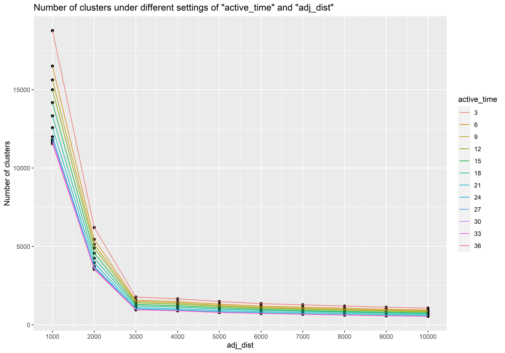
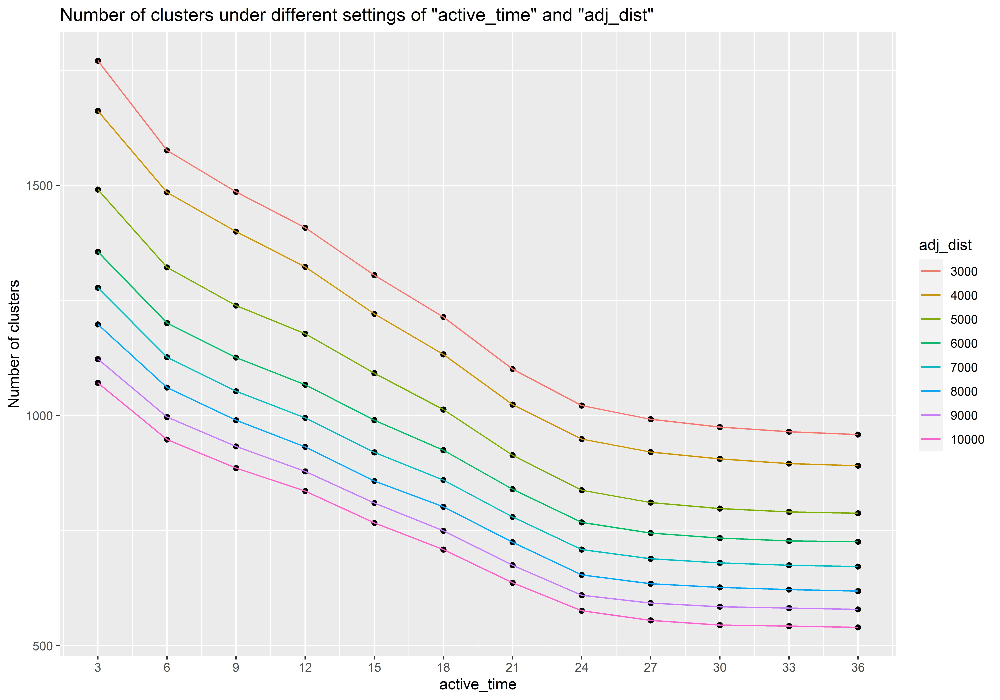

# Effects of parameter choices in the clustering algorithm

The popularity of **DBSCAN** [@ester1996density] is partially due to the parameter tuning tools it provides. In this section, we will introduce the parameter tuning tool for our algorithm. 

There are only two parameters used in the algorithm, which are $ActiveTime$ and $AdjDist$. Increase the tolerance of undetectable time or the potential fire speed will usually reduce the total number of clusters. However, if there are large gaps between clusters spatially, increase the parameter $AdjDist$ will not significantly reduce the number of clusters. Similarly, if there are large gaps between clusters temporally, the increase of $ActiveTime$ will have limited impact on the number of clusters. In clustering algorithms, one of the metrics to measure the quality of the clustering results is the gap between clusters. Therefore, if we can find a point where the marginal effect of $ActiveTime$ and $AdjDist$ on the number of clusters is small, we may potentially obtain a reasonable choice of the parameters. Meanwhile, if the gaps are large enough, we may observe small marginal effect when $ActiveTime$ and $AdjDist$ are over certain values. Thus, it is insufficient to pick the optimal value just by asking for a small marginal effect. Instead, we are going to check the first-order derivative of the marginal effect. The motivation is if the first-order derivative of the marginal effect is large, it means we are crossing a line where a great proportion of noisy hotspots are not seen as individual clusters anymore. 

Figure \ref{fig:ctone} and Figure \ref{fig:cttwo} shows the effects of parameter choices on the number of clusters. It works like the scree plot [@cattell1966scree]. The scree plot is originally used for finding statistically significant components in principal component analysis (**PCA**). In our application, we need to find the "elbow" of the graph to choose the value for our parameters. The "elbow" is an indication of the first-order derivative of the marginal effect is large. In Figure \ref{fig:ctone}, it's very clear we need to choose 3000km for $AdjDist$. And in Figure \ref{fig:cttwo}, we choose 24 hours for $ActiveTime$.

```{r ctone, fig.cap = "A visulization tool for parameter tuning in our algorithm. It works like a scree plot. We need to choose a point with a large second-order derivative. The reasonable choice of the parameter AdjDist is 3000km.", out.width="100%"}

```

```{r cttwo, fig.cap = "A visulization tool for parameter tuning in our algorithm. It works like a scree plot. We need to choose a point with a large second-order derivative. The reasonable choice of the parameter ActiveTime is 24 hours.",out.width="100%"}

```

# Hyperparameter tuning for ignition classifiers

```{r}
tibble(Hyperparameter = c("Multinomial logistic regression", "decay"), 
       Range = c("", "{0.2h|h = 1, 2, ..., 10}")) %>%
  bind_rows(tibble(Hyperparameter = c("Random forest", "mtry"), 
       Range = c("", "{h|h=1, 2, ..., 10}"))) %>%
  bind_rows(tibble(Hyperparameter = c("XGBoost", "max_depth", "nrounds", "eta", "subsample", "gamma", "colsample_bytree", "min_child_weight"), 
       Range = c("", "{3, 5, 7, 9}", "{50h|h = 1, 2, ..., 200}", "{0.3, 0.2, 0.1, 0.05, 0.025, 0.0125, 0.00625}", "{0.05h|h = 10, 11, ..., 18}", "{0.2h|h = 0, 1, ..., 5}", "{0.05h|h = 10, 11, ..., 18}", "{1, 3, 5, 7}"))) %>%
  knitr::kable('latex',
               booktabs = T,
               label = 'hpgrid',
               caption = "A grid of values tested in hyperparameter tuning for each candidate model.")  %>%
  row_spec(c(2, 4), hline_after = T) %>%
  kableExtra::add_indent(c(2, 4, 6:12))
```


(ref:hpgridtwodetail) A description of each hyperparameter. The definition of the hyperparameters is referenced from the documentations of the package `nnet` [@R-nnet], package `randomForest`[@R-rf] and package `xgboost` [@R-xgboost].

```{r}
tibble(Hyperparameter = c("Multinomial logistic regression", "decay"), 
       Description = c("", "Parameter for weight decay")) %>%
  bind_rows(tibble(Hyperparameter = c("Random forest", "mtry"), 
       Description = c("", "Number of variables randomly sampled as candidates at each split"))) %>%
  bind_rows(tibble(Hyperparameter = c("XGBoost", "max_depth", "nrounds", "eta", "subsample", "gamma", "colsample_bytree", "min_child_weight"), 
       Description = c("", "Maximum depth of a tree", "The number of rounds for boosting", "Step size shrinkage used in update to prevents overfitting", "Subsample ratio of the training instances", "Minimum loss reduction required to make a further partition on a leaf node of the tree", "subsample ratio of columns when constructing each tree", "Minimum sum of instance weight (hessian) needed in a child"))) %>%
  knitr::kable('latex',
               booktabs = T,
               label = 'hpgridtwo',
               caption = "(ref:hpgridtwodetail)")  %>%
  row_spec(c(2, 4), hline_after = T) %>%
  kableExtra::add_indent(c(2, 4, 6:12)) %>%
  kableExtra::kable_styling(latex_options = "scale_down")
```

```{r}
tibble(Hyperparameter = c("Multinomial logistic regression", "decay"), 
       Value = c("", "0.2")) %>%
  bind_rows(tibble(Hyperparameter = c("Random forest", "mtry"), 
       Value = c("", "1"))) %>%
  bind_rows(tibble(Hyperparameter = c("XGBoost", "max_depth", "nrounds", "eta", "subsample", "gamma", "colsample_bytree", "min_child_weight"), 
       Value = c("", "5", "4800", "0.025", "0.85", "0.8", "0.55", "1"))) %>%
  knitr::kable('latex',
               booktabs = T,
               label = 'hpgridthree',
               caption = "The final result of the hyperparameter tuning.")  %>%
  row_spec(c(2, 4), hline_after = T) %>%
  kableExtra::add_indent(c(2, 4, 6:12))
```

# Model performance


```{r}
data.frame(Lightning = c(568,182,22,5,777), 
           Accident = c(259,277,77,21,634),
           Arson = c(74,120,120 ,11, 325),
           Burning_off = c(33,51,30,22, 136),
           Total = c( 934, 630, 249, 59, 1872)) %>%
   mutate(Lightning = c(paste0(Lightning[1:4], " (", round(Lightning[1:4]/Lightning[5]*100, 1), "%)" ), paste0(Lightning[5]))) %>%
  mutate(Accident = c(paste0(Accident[1:4], " (", round(Accident[1:4]/Accident[5]*100, 1), "%)" ), paste0(Accident[5]))) %>%
  mutate(Arson = c(paste0(Arson[1:4], " (", round(Arson[1:4]/Arson[5]*100, 1), "%)" ), paste0(Arson[5]))) %>%
  mutate(Burning_off = c(paste0(Burning_off[1:4], " (", round(Burning_off[1:4]/Burning_off[5]*100, 1), "%)" ), paste0(Burning_off[5]))) %>%
  `row.names<-`(c("Prediction:Lightning", "Prediction:Accident", "Prediction:Arson", "Prediction:Burning_off", "Total")) %>%
  knitr::kable('latex',
               booktabs = T,
               caption = "Confusion matrix of multinomial logit model. The overall accuracy was 0.5272.")
```

```{r}
data.frame(Lightning = c(663,74,31,9,777), 
           Accident = c(114,434,72,14,634),
           Arson = c(64,106,144 ,11, 325),
           Burning_off = c(45,33,30,28, 136),
           Total = c( 934, 630, 249, 59, 1872)) %>%
  
   mutate(Lightning = c(paste0(Lightning[1:4], " (", round(Lightning[1:4]/Lightning[5]*100, 1), "%)" ), paste0(Lightning[5]))) %>%
  mutate(Accident = c(paste0(Accident[1:4], " (", round(Accident[1:4]/Accident[5]*100, 1), "%)" ), paste0(Accident[5]))) %>%
  mutate(Arson = c(paste0(Arson[1:4], " (", round(Arson[1:4]/Arson[5]*100, 1), "%)" ), paste0(Arson[5]))) %>%
  mutate(Burning_off = c(paste0(Burning_off[1:4], " (", round(Burning_off[1:4]/Burning_off[5]*100, 1), "%)" ), paste0(Burning_off[5]))) %>%
  `row.names<-`(c("Prediction:Lightning", "Prediction:Accident", "Prediction:Arson", "Prediction:Burning_off", "Total")) %>%
  knitr::kable('latex',
               booktabs = T,
               caption = "Confusion matrix of GAM model. The overall accuracy was 0.6779.")
```

```{r}
data.frame(Lightning = c(695,53,22,7,777), 
           Accident = c(87,465,72,10,634),
           Arson = c(42,85,183 ,15, 325),
           Burning_off = c(36,38,22,40, 136),
           Total = c( 934, 630, 249, 59, 1872)) %>%
  
   mutate(Lightning = c(paste0(Lightning[1:4], " (", round(Lightning[1:4]/Lightning[5]*100, 1), "%)" ), paste0(Lightning[5]))) %>%
  mutate(Accident = c(paste0(Accident[1:4], " (", round(Accident[1:4]/Accident[5]*100, 1), "%)" ), paste0(Accident[5]))) %>%
  mutate(Arson = c(paste0(Arson[1:4], " (", round(Arson[1:4]/Arson[5]*100, 1), "%)" ), paste0(Arson[5]))) %>%
  mutate(Burning_off = c(paste0(Burning_off[1:4], " (", round(Burning_off[1:4]/Burning_off[5]*100, 1), "%)" ), paste0(Burning_off[5]))) %>%
  `row.names<-`(c("Prediction:Lightning", "Prediction:Accident", "Prediction:Arson", "Prediction:Burning_off", "Total")) %>%
  knitr::kable('latex',
               booktabs = T,
               caption = "Confusion matrix of XGBoost model. The overall accuracy was 0.7388.")
```


# Supplementary material

Supplementary materials include figures, codes and documentations can be found in the Github repository of this project https://github.com/TengMCing/bushfire-paper
